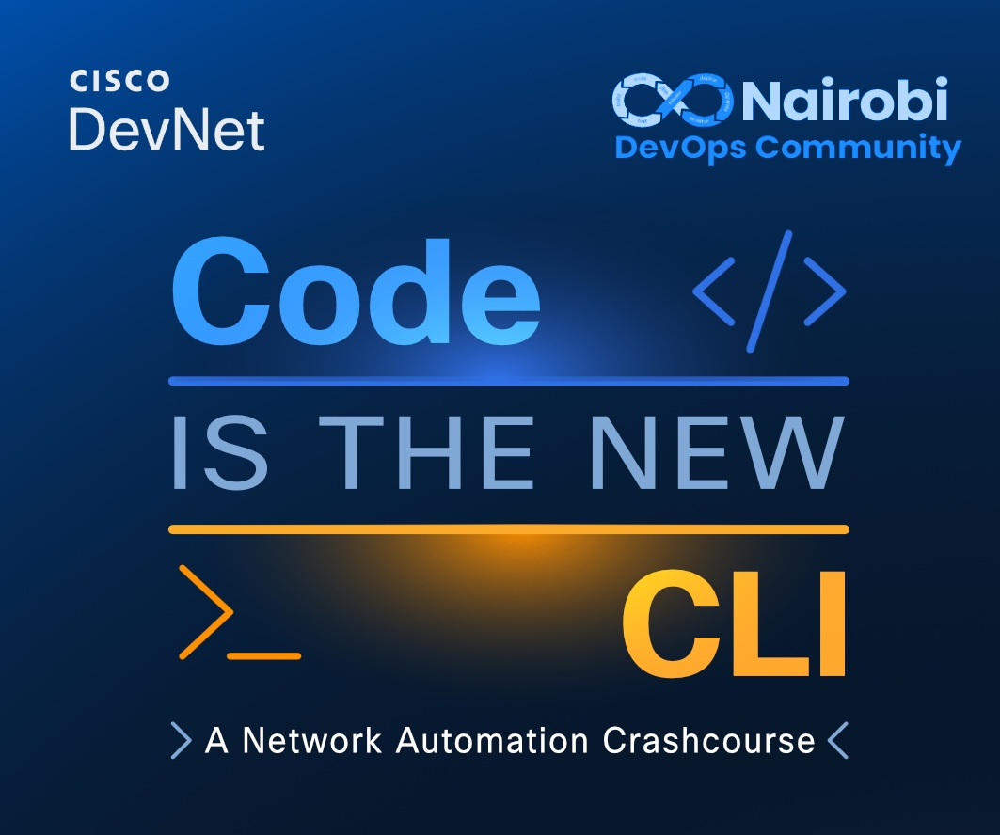
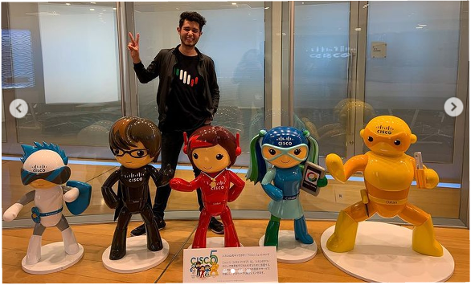

<div align="center">
    </br></br>
    <h1><code>🤖💻 {Code} is The New CLI >_ ✨</code></h1>
    
    
    
    
    
    

</div>

---

## 👋 Welcome

To everyone joining from the **Nairobi DevOps Community** and beyond: welcome. This repository is your central hub for demos, code, and homework throughout the course. Whether you are a seasoned network engineer taking your first steps into programmability, or a developer stepping into the networking world, you are in the right place.

Glad to have you here. Let's build something real.

---

## 🤔 Why Code-Driven Networking Is Overdue

APIs, structured data, version-controlled configs, infrastructure as code. The tools have been here for years. Yet a large portion of the industry still reaches for the CLI first. The resistance comes down to three things:

**1. 🤝 Trust in the code.** Running a script against 200 routers feels riskier than typing a command, but that gap closes fast once you work with tools that are actually robust and idempotent.

**2. 🧰 Knowledge of the right stack.** There is a real difference between a fragile loop of `send_command()` calls and a production-grade solution built on Ansible, Terraform, or model-driven APIs. Knowing which tool fits which problem is the craft.

**3. 🚀 A shift in roles.** Automation does not replace the network engineer. It upgrades the job. Configuration becomes a codebase, changes go through review, and tools become part of a much bigger workflow.

### 🤖 A note on AI and vibe-coded automation

Yes, you can prompt an LLM to write your Ansible playbook today. That is genuinely useful. But in networking, a bad suggestion pushed to production can take down services in seconds. AI output is only as good as your prompt, your domain knowledge, and your ability to validate what comes back. The more you understand the underlying protocols and tooling, the better your prompts become, and the more safely you can use AI as an accelerator rather than a co-pilot flying blind. **Knowing what to ask, and knowing how to verify the answer, is the core skill this course develops.**

---

## 📅 Course Agenda

| Date | Session | Topics |
|:-----|:--------|:-------|
| **April 27** | [🔗 Foundations & Data Handling](./session-01-foundations/) | Python for network engineers, data formats (JSON, YAML, XML), parsing and templating, working with structured data |
| **April 30** | APIs & Network Interaction | REST APIs, HTTP fundamentals, authentication, using requests, interacting with network devices via API |
| **May 4** | Infrastructure & Automation Part 1 | Infrastructure as Code concepts, Ansible for network automation, Terraform for network infrastructure, model-driven programmability |
| **May 7** | Infrastructure & Automation Part 2 | NETCONF, RESTCONF, gNMI protocols, streaming telemetry, observability at scale |

---

## 👋🏽 About your instructor

| | |
|:---:|:---|
|  | <pre>!&#10;username Alfonso-(Poncho)-Sandoval&#10;!&#10;role developer title "Developer Avocado 🥑"&#10;organization "Cisco DevNet"&#10;location "Lisbon 🇵🇹 "&#10;!&#10;interface LinkedIn0/0&#10; ip address linkedin.com/in/asandovalros&#10; no shutdown&#10;!&#10;interface GitHub0/1&#10; ip address github.com/ponchotitlan&#10; no shutdown&#10;!&#10;end&#10;!&#10;</pre> |

---

## 🚀 Getting Started

Clone this repository and keep it close throughout the course:

```bash
git clone https://github.com/ponchotitlan/code-is-the-new-cli.git
cd code-is-the-new-cli
```

---

<div align="center">
    <sub>Built with ☕ and a healthy frustration with manual CLI configs.</sub>
</div>
