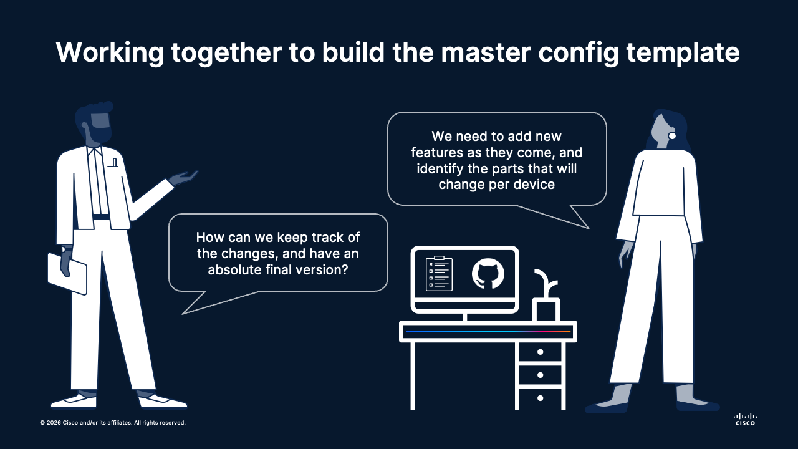

# 🌐 Session 01 | Lesson 01: Version Control for Network Engineers
Topics: 🗂️ Git basics · 🌿 Branching · 🤝 Collaboration workflows

---

## 🎯 By the end of this session you will be able to:

| # | Skill |
|:---:|:---|
| 1 | 📦 Initialize a Git repository and commit network configuration artifacts |
| 2 | 🌿 Use branches to isolate parallel changes across a team |
| 3 | 🔍 Open a Pull Request to review configuration deltas before they hit production |
| 4 | ⚠️ Resolve merge conflicts on network template files |
| 5 | 🏷️ Tag a release to mark an approved change window snapshot |

---

## 🗺️ What is going on

<div align="center"></div></br>

---

Two engineers, **Alice** and **Bob**, are deploying a new branch office.

They have one week before the maintenance window. They need to agree on a Cisco IOS master template (`branch-site-template.ios`) that will be pushed to
the branch routers during the change window.

**However,** it happened that in the latest deployment, there was a lot of confusion. Nobody was sure of the final version, also it was missing configurations, among many other things (provided that it was a spreadsheet file ...).

This time, they will `treat this file as code, and collaborate together on GitHub for building the ultimate version`.

**🏅 Golden rule No.1:**
> `main` is sacred: it is what goes to production.

---

## 📁 Repository Setup

Bob logins to github.com with his account, creates a new repository on his own account, and clones it on his computer.
He then navigates to the folder where the golden template will be located.

```bash
git clone git@github.com:<your-username>/<your-repo-name>.git
cd <your-repo-name>/session-01-foundations/01-howto-versioning/network-templates
```

> 2 ways to clone a repository: **HTTP** and **SSH**. The latter requires you to [setup your SSH keys](https://docs.github.com/en/authentication/connecting-to-github-with-ssh/about-ssh).

---

## 📄 Initial Template: `main` branch

This is the skeleton agreed upon by both engineers: File `branch-site-template.ios`.

```ios
! ============================================================
! Branch Site Master Template - DRAFT
! Repo: network-templates | Branch: main
! ============================================================

hostname <put here the branch hostname>
!
ip domain-name corp.example.com
ip name-server 8.8.8.8
!
! --- WAN Interface ---
interface GigabitEthernet0/1
 description WAN_UPLINK
 ! PENDING: IP assignment from Alice (see feature/wan-routing)
 shutdown
!
! --- LAN Interface ---
interface GigabitEthernet0/2
 description LAN_INTERNAL
 ! PENDING: VLAN and IP scheme (see feature/wan-routing)
 shutdown
!
! --- Routing ---
! PENDING: OSPF configuration (see feature/wan-routing)
!
! --- Management Plane ---
! PENDING: AAA, NTP, SNMP, SSH hardening (see feature/security-base)
!
end
```

So it will go in the `main` branch. This is the starting point!

Bob creates the file, adds it to the project scope, and commits it:

```bash
git add branch-site-template.ios
git commit -m "feat(template): add golden template basic skeleton"
git push
```

---

## ✍️ About the Commit Messages (an art)

A commit message is the audit trail for your change. In network operations, a vague commit like `"updated config"` is as useless as a change ticket that says `"fixed stuff"`. Good messages let you (and your teammates) understand *what changed*, *why*, and *what it affects*, without reading the diff.

### 📐 The Format: Conventional Commits

```
<type>(<scope>): <short summary>

[optional body: what and why, not how]

[optional footer: issue refs, breaking changes]
```

**The summary line must:**
- Be 50 characters or fewer
- Use the **imperative mood**: `add`, `fix`, `remove`: not `added`, `fixes`, `removed`
- Not end with a period

### 🏷️ Commit Type Tags

| Tag | When to use it | Network example |
|:---|:---|:---|
| `feat` | New configuration or capability added | `feat(ospf): add area 10 for branch LAN segment` |
| `fix` | Correcting a misconfiguration or bug | `fix(acl): correct permit sequence for VLAN 50 traffic` |
| `chore` | Housekeeping, no production impact | `chore: add initial skeleton template` |
| `refactor` | Restructuring without changing behavior | `refactor(ntp): consolidate NTP config into single stanza` |
| `docs` | README or comment updates only | `docs: add inline comments to OSPF passive-interface block` |
| `test` | Lab/staging validation changes | `test: validate BGP peering on staging router` |
| `revert` | Undoing a previous commit | `revert: revert "feat(bgp): add new peer 10.0.0.5"` |

### ✅ Good vs. Bad Examples

| ❌ Vague | ✅ Meaningful |
|:---|:---|
| `update config` | `feat(wan): assign 203.0.113.2/30 to GigabitEthernet0/1` |
| `fix` | `fix(ssh): set exec-timeout to 10 min on vty lines` |
| `changes` | `feat(snmp): add SNMPv3 auth-only group for monitoring` |
| `final version` | `chore: tag mw-2026-04-24 as approved production template` |
| `added stuff` | `feat(aaa): integrate TACACS+ with fallback to local auth` |

### 💡 The Body: Use It for the "Why"

The summary says *what*. The body explains *why* it was necessary:

```bash
git commit -m "fix(ospf): remove area 0 network statement for 10.10.50.0/24

The LAN subnet was inadvertently redistributed into the backbone.
It should remain passive in area 10 only. This caused a routing
loop during the last maintenance window on site B."
```

---

## 👩‍💻 Alice: Branch `feature/wan-routing`

Alice owns the **data plane**: IP addressing, interfaces, and OSPF peering back to the hub site.

```bash
git checkout -b feature/wan-routing
```

She updates `branch-site-template.ios` with the following sections.

> While doing so, she also updates the `ip name-server` line: the IP Plan doc for branch sites specifies `10.10.50.53` as the local DNS resolver for the branch LAN.

```ios
!
! --- DNS ---
ip name-server 10.10.50.53
!
! --- WAN Interface ---
interface GigabitEthernet0/1
 description WAN_UPLINK_ISP-PRIMARY
 ip address 203.0.113.2 255.255.255.252
 ip ospf 1 area 0
 no shutdown
!
! --- LAN Interface ---
interface GigabitEthernet0/2
 description LAN_INTERNAL_USERS
 ip address 10.10.50.1 255.255.255.0
 ip ospf 1 area 10
 no shutdown
!
! --- OSPF ---
router ospf 1
 router-id <put here the router's ID>
 passive-interface GigabitEthernet0/2
 network 203.0.113.0 0.0.0.3 area 0
 network 10.10.50.0 0.0.0.255 area 10
 default-information originate
!
ip route 0.0.0.0 0.0.0.0 203.0.113.1
!
```

```bash
git add branch-site-template.ios
git commit -m "feat(template): add WAN interface, LAN interface, and OSPF area config"
git push origin feature/wan-routing
```

Alice opens a **Pull Request**: *"WAN & Routing config for branch site"*

The PR diff shows exactly which lines change on the device.

> Right now, the branches of the project look like this:

```
  main     o─────────────────────────────────────────── (skeleton committed)
             \
              \  git checkout -b feature/wan-routing
               \
  feature/      o── commit: "feat: WAN interface, LAN, OSPF" ──► (PR open 🔍)
  wan-routing
```
---

## ⤵️ Merging Alice's changes

After checking Alice's Pull Request, Bob merges the changes from her branch (`feature/wan-routing`) into the `main` branch.

> **LGTM** means "Looks Good To Merge". A classic joke in the git world!

> The repository branches now look like this:

```
  main     o──────────────────────────────────────────o  ◄── Alice's changes merged ✅
             \                                        /
              \  git checkout -b feature/wan-routing /
               \                                    /
  feature/      o── "feat: WAN, LAN, OSPF config" ─┘  (branch closed after merge)
  wan-routing
```

---

## 👨‍💻 Bob: Branch `feature/security-baseline`

Bob works in parallel on the management plane: hardening, AAA, NTP, SNMP.

```bash
git checkout main
git checkout -b feature/security-baseline
```

He updates `branch-site-template.ios` with:

> For SSH to work, `crypto key generate rsa` requires a domain name **and** a resolvable hostname. Bob updates `ip name-server` to `10.0.0.53`, the centralized corporate DNS listed in the management standards doc.

```ios
!
! --- DNS ---
ip name-server 10.0.0.53
!
```

```ios
!
! --- AAA / TACACS ---
aaa new-model
aaa authentication login default group tacacs+ local
aaa authorization exec default group tacacs+ local
!
tacacs server CORP-TACACS
 address ipv4 10.0.0.10
 key <put here the TACAC's secret>
!
! --- SSH Hardening ---
ip domain-name corp.example.com
crypto key generate rsa modulus 4096
ip ssh version 2
ip ssh time-out 60
ip ssh authentication-retries 3
line vty 0 4
 transport input ssh
 exec-timeout 10 0
!
! --- NTP ---
ntp server 10.0.0.5 prefer
ntp server 10.0.0.6
!
! --- SNMP (read-only, v3 auth) ---
snmp-server group NETOPS v3 auth
snmp-server user MONITORING NETOPS v3 auth sha <put here the SNMP auth key>
snmp-server host 10.0.0.20 version 3 auth MONITORING
!
! --- Banners ---
banner login ^
  AUTHORIZED ACCESS ONLY
  All activity is monitored and logged.
^
!
service password-encryption
no ip http server
no ip http secure-server
```

```bash
git add branch-site-template.ios
git commit -m "feat: add AAA/TACACS, SSH hardening, NTP, SNMPv3, and login banner"
git push origin feature/security-baseline
```

Bob opens a **Pull Request**: *"Security baseline for branch site"*

> The repository branches now look like this:

```
  main     o────o────────────────────o  ◄── Alice's changes merged ✅
                 \             
                  \             
                   \
                    o── "feat: AAA, SSH, NTP, SNMPv3" ──► (PR open 🔍)
                        feature/security-baseline
                        (Bob branched from here, BEFORE Alice's merge)
```

> ⚠️ Both branches modified `ip name-server` from the same skeleton base.
> Git does not know this yet — the conflict will surface when Bob merges `main`.

---

## ⚠️ The Merge Conflict

Alice's PR was merged first. When Bob pulls `main` into his branch to prepare his PR, Git detects a conflict: both engineers updated the `ip name-server` line from the skeleton's placeholder (`8.8.8.8`), but each used a different value from a different reference document:

```bash
git checkout feature/security-baseline
git merge main                    # conflict triggered here
```

```
Automatic merge failed; fix conflicts and then commit the result.
```

Git marks the conflict in `branch-site-template.ios`:

```
<<<<<<< HEAD (feature/security-baseline: Bob's work)
ip name-server 10.0.0.53
=======
ip name-server 10.10.50.53
>>>>>>> main (Alice's merged work)
```

This is a classic parallel-work conflict: two engineers, one skeleton, two different sources of truth. The resolution requires a conversation.

After a quick Slack message, they agree: the branch needs **both**: the local resolver for LAN traffic, and the central one as fallback:

```ios
ip name-server 10.10.50.53
ip name-server 10.0.0.53
```

Bob commits the resolution and pushes:

```bash
# resolve the conflict in your editor
git add branch-site-template.ios
git commit -m "fix(dns): keep both name-servers, local primary and central fallback"
git push
```

The resolved PR diff now shows the complete, correct final template.
Bob's PR is reviewed and merged. ✅

> The repository branches now look like this:

```
  main     o──────────────────────o──────────────────────────────────────o
  (skeleton)\  \                  / ◄── Alice merged ✅                  / ◄── Bob merged ✅
              \  \               /                                      /
  feat/        \  o─────────────┘                                      /
  wan-routing   \ "feat: WAN, LAN, OSPF" (closed)                     /
                 \                                                   /
  feat/           o──────────────────────────────────────────────o──┘
  security-base   "feat: AAA, SSH, NTP, SNMPv3"
  (closed)        "fix(dns): resolve name-server conflict"
```

> Both branches forked from the same skeleton commit.
> Bob's branch was already in progress when Alice's PR was merged.

---

## 🏷️ Tagging the Maintenance Window

With both PRs merged and the template fully reviewed, tag the commit:

```bash
git tag -a mw-2026-04-27-branch-site-A -m "Approved template for branch site A maintenance window"
git push origin --tags
```

Any engineer can now run:

```bash
git checkout mw-2026-04-27-branch-site-A
```

to get the exact config that was pushed to the device: a permanent, auditable record.
No more `router1_config_FINAL_v3_REAL.xls` in a shared drive.

---

## 🧠 Concept Mapping

| Git concept | Network engineering equivalent |
|---|---|
| `main` branch | The approved config before a change window |
| Feature branch | Working copy during design and planning |
| Pull Request | Change Request peer review |
| PR diff view | Delta report: what exactly changes on the device? |
| Merge conflict | Two engineers editing the same section of a runbook |
| `git tag` | Timestamped config backup, but queryable and navigable |

---

## 🚀 What's Next

The template uses a couple of placeholders in some of the configurations (<put here X value>).
The natural next question is: **how do we fill these in automatically for each site?**

That is the bridge to **Session 02: Templating with Jinja2 and variable files**.
