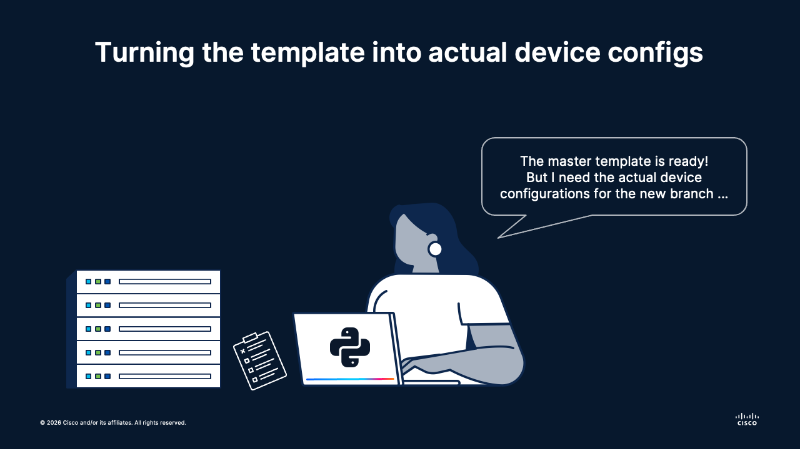

# 🥷 Session 02: Jinja for Device Config Templates
Topics: 🧩 Jinja placeholders · 🐍 Template rendering · 🛡️ Virtual Environments

---

## 🎯 By the end of this session you will be able to:

| # | Skill |
|:---:|:---|
| 1 | 🧱 Identify static versus variable parts in a network device template |
| 2 | 🏷️ Replace hard-coded values with Jinja placeholders using `{{PLACEHOLDER}}` format |
| 3 | 🐍 Render a Cisco-style configuration from structured Python data with Jinja2 |
| 4 | 🔎 Verify rendered output for syntax and operational safety before deployment |
| 5 | 🚀 Prepare a reusable workflow for generating per-branch device configs at scale |

---

## 🗺️ What is going on

<div align="center"></div></br>

---

Did you notice that the master template that Alice and Bob created had placeholders?

Every site needs the same baseline controls, but each site has unique values like hostname, router ID, and shared secrets. Manually editing each config keeps introducing drift and mistakes.

They solve this by turning a static master config into a Jinja template, then feeding site-specific variables into a small Python renderer. The result is repeatable, auditable, and much faster than hand-editing. Say goodbye to manual copy/paste!

**🏅 Golden rule No.2:**
> Render from data, not from copy-paste.

---

## 🧩 Why Jinja for Network Configs

Jinja is a Python library that lets you keep one canonical template and inject only the values that differ between devices. This lowers risk and keeps standards consistent across branches.

For this case, we have the master template `branch-site-template-ios.j2` that we created in the previous session:

```ios
! ============================================================
! Branch Site Master Template
! Repo: network-templates | Branch: main
! ============================================================

hostname {{BRANCH_HOSTNAME}}
!
ip domain-name corp.example.com
! --- DNS ---
ip name-server 10.10.50.53
!
! --- WAN Interface ---
interface GigabitEthernet0/1
 description WAN_UPLINK_ISP-PRIMARY
 ip address 203.0.113.2 255.255.255.252
 ip ospf 1 area 0
 no shutdown
!
! --- LAN Interface ---
interface GigabitEthernet0/2
 description LAN_INTERNAL_USERS
 ip address 10.10.50.1 255.255.255.0
 ip ospf 1 area 10
 no shutdown
!
! --- OSPF ---
router ospf 1
 router-id {{BRANCH_ROUTER_ID}}
 passive-interface GigabitEthernet0/2
 network 203.0.113.0 0.0.0.3 area 0
 network 10.10.50.0 0.0.0.255 area 10
 default-information originate
!
ip route 0.0.0.0 0.0.0.0 203.0.113.1
!
! --- AAA / TACACS ---
aaa new-model
aaa authentication login default group tacacs+ local
aaa authorization exec default group tacacs+ local
!
tacacs server CORP-TACACS
 address ipv4 10.0.0.10
 key {{TACACS_SECRET}}
!
! --- SSH Hardening ---
ip domain-name corp.example.com
crypto key generate rsa modulus 4096
ip ssh version 2
ip ssh time-out 60
ip ssh authentication-retries 3
line vty 0 4
 transport input ssh
 exec-timeout 10 0
!
! --- NTP ---
ntp server 10.0.0.5 prefer
ntp server 10.0.0.6
!
! --- SNMP (read-only, v3 auth) ---
snmp-server group NETOPS v3 auth
snmp-server user MONITORING NETOPS v3 auth sha {{SNMP_AUTH_KEY}}
snmp-server host 10.0.0.20 version 3 auth MONITORING
!
! --- Banners ---
banner login ^
  AUTHORIZED ACCESS ONLY
  All activity is monitored and logged.
^
!
service password-encryption
no ip http server
no ip http secure-server
!
end
```

> The `.j2` extension is used for Jinja template files.

The configurations of this template can be split into two types:

| Type | Examples |
|---|---|
| Static baseline | AAA model, SSH settings, NTP servers, hardening commands |
| Dynamic per-site values | `{{BRANCH_HOSTNAME}}`, `{{BRANCH_ROUTER_ID}}`, `{{TACACS_SECRET}}`, `{{SNMP_AUTH_KEY}}` |

> Tip: Keep variable names uppercase with clear prefixes to make required data obvious.

---

## 🗃️ Source of Truth: CSV Inventory

For multi-site rollout, the source of truth is a CSV file where each row represents one branch router. The renderer reads one row, maps columns to Jinja variables, and generates one device-ready config per row.

> Of course, we want to ditch using spreadsheets forever, but for now we will use this one as an example. Later on in the course we will see some other device inventory options.

The file named `branch-sites.csv` has the following records:

```csv
site_code,BRANCH_HOSTNAME,BRANCH_ROUTER_ID,TACACS_SECRET,SNMP_AUTH_KEY
BOS01,RTR-BOS-01,10.255.1.1,Tacacs_BOS01_2026!,SnmpAuth_BOS01_2026!
DEN01,RTR-DEN-01,10.255.2.1,Tacacs_DEN01_2026!,SnmpAuth_DEN01_2026!
MIA01,RTR-MIA-01,10.255.3.1,Tacacs_MIA01_2026!,SnmpAuth_MIA01_2026!
SEA01,RTR-SEA-01,10.255.4.1,Tacacs_SEA01_2026!,SnmpAuth_SEA01_2026!
PHX01,RTR-PHX-01,10.255.5.1,Tacacs_PHX01_2026!,SnmpAuth_PHX01_2026!
```

CSV design rules:

1. Column names must match your Jinja placeholders exactly.
2. Keep one row per device.
3. Validate uniqueness for hostname and router ID before rendering.
4. Store production secrets in a secure vault and inject them at runtime.

---

## 🐍 Render the Template with Python and Jinja2

Use a Python virtual environment so project dependencies stay isolated from your system Python. This is ideal because everyone in the team runs the same package versions with fewer conflicts.

The shared virtual environment and `requirements.txt` for all lessons in this session live in the `session-01-foundations/` folder. Create it once and reuse it across all sub-lessons.

> The libraries for every lesson are listed in `session-01-foundations/requirements.txt`.

```bash
cd session-01-foundations
python3 -m venv .venv
source .venv/bin/activate
pip install -r requirements.txt
```

With the virtual environment active, navigate into the lesson subfolder before running the script:

```bash
cd 02-howto-templates
```

Having deployed the virtual environment and installed the library, we will run this Python script:

```python
# --- Imports: bring in the tools we need ---
import csv
from pathlib import Path
from jinja2 import Template

# --- Inputs: edit these paths if you move the files ---
TEMPLATE_PATH = Path("branch-site-template-ios.j2")
INVENTORY_PATH = Path("branch-sites.csv")

# --- Load the template once, reuse it for every device ---
template = Template(TEMPLATE_PATH.read_text(encoding="utf-8"))

# --- Loop: one rendered config file per row in the CSV ---
with INVENTORY_PATH.open(encoding="utf-8") as f:
    for row in csv.DictReader(f):
        output_path = Path(f"{row['BRANCH_HOSTNAME']}.cfg")
        output_path.write_text(template.render(**row), encoding="utf-8")
        print(f"✅ Rendered config saved to {output_path}")
```

Execute this command to run the script:

```bash
python config_renderer.py
```

Afterwards, you will get your files and the following output:

```bash
✅ Rendered config saved to RTR-BOS-01.cfg
✅ Rendered config saved to RTR-DEN-01.cfg
✅ Rendered config saved to RTR-MIA-01.cfg
✅ Rendered config saved to RTR-SEA-01.cfg
✅ Rendered config saved to RTR-PHX-01.cfg
```

---

## 🧠 Concept Mapping

| Automation concept | Network operations equivalent |
|---|---|
| Jinja template | Master configuration standard with fixed and variable data |
| Variables file | Site inventory sheet |
| Render step | Build phase before change window |
| Final `.cfg` file | Device-ready implementation document |

---

## 🚀 What's Next

The script works, and you just ran it. But what happens when a teammate needs to use it without reading the code? Or wants to add error handling on top? Right now it is a script. In the next session we turn it into a proper tool: structured into functions, documented with docstrings and type hints, and driven by CLI arguments so anyone can run it without editing a single line of source.

That is the bridge to **Session 03: From Script to Tool: Python Standards for Network Automation**.
