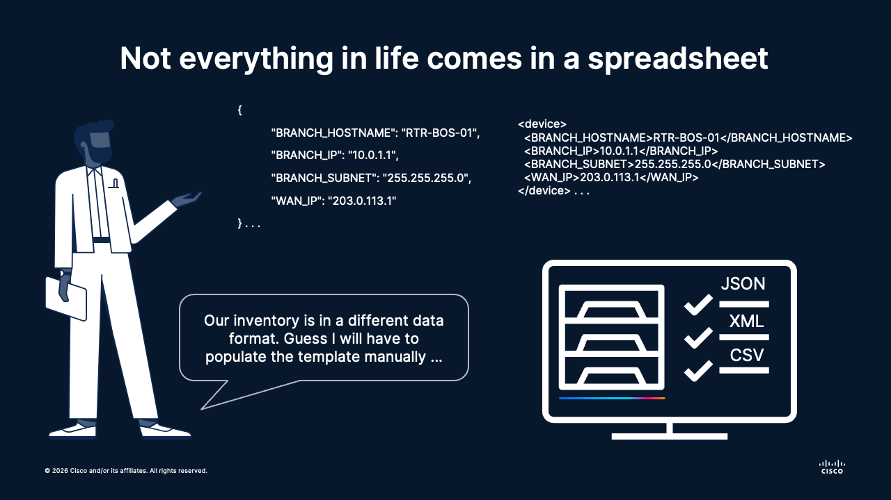

# 📦 Session 04: Structured Data for Network Engineers - JSON and XML Parsing
Topics: 📄 JSON · 🌐 XML · 🔍 Parsing · 🔧 Adapting tools

---

## 🎯 By the end of this session you will be able to:

| # | Skill |
|:---:|:---|
| 1 | 📄 Read and understand JSON exports produced by modern IPAM and CMDB tools |
| 2 | 🌐 Navigate XML exports from legacy network management tools and reports |
| 3 | 🔍 Extract specific values from nested JSON and XML structures with Python |
| 4 | 🔄 Adapt `config_renderer.py` to accept JSON or XML as inventory input |
| 5 | ⚖️ Choose the right format for the job based on the data source |

---

## 🗺️ What is going on

<div align="center"></div></br>

---

The renderer works perfectly, as long as the inventory is a CSV. Then the team migrates to NetBox as their IPAM tool. Ops exports the branch site inventory directly from the NetBox UI and drops a JSON file in the shared drive. Bob finds an older XML export from the legacy IPAM tool that was replaced two years ago and never migrated; it still has the most complete record of the WAN addressing scheme. Poncho downloads a NetBox report for a third site, also XML.

The data is all there. The template is ready. The tool breaks on every single file.

The problem isn't the renderer: it's that the team assumed the world speaks CSV. Before touching the code, they need to learn how to *read* the formats their tools actually produce.

**🏅 Golden rule No.4:**
> Understand your data before you write the code that reads it.

---

## 📄 Why JSON?

JSON (JavaScript Object Notation) is the default format for REST APIs. It maps directly to Python dictionaries and lists, which makes it easy to work with using the built-in `json` module.

A branch site entry that was a CSV row now looks like this:

```json
{
  "BRANCH_HOSTNAME": "RTR-BOS-01",
  "BRANCH_IP": "10.0.1.1",
  "BRANCH_SUBNET": "255.255.255.0",
  "WAN_IP": "203.0.113.1"
}
```

Parsing it in Python:

```python
import json

with open("inventory.json", encoding="utf-8") as f:
    devices = json.load(f)

for device in devices:
    print(device["BRANCH_HOSTNAME"])
```

---

## 🌐 Why XML?

XML (eXtensible Markup Language) is the format behind **NETCONF** and many older vendor APIs. It is more verbose than JSON, but it carries structure, namespaces, and ordering that matter for network configuration.

The same branch site in XML:

```xml
<device>
  <BRANCH_HOSTNAME>RTR-BOS-01</BRANCH_HOSTNAME>
  <BRANCH_IP>10.0.1.1</BRANCH_IP>
  <BRANCH_SUBNET>255.255.255.0</BRANCH_SUBNET>
  <WAN_IP>203.0.113.1</WAN_IP>
</device>
```

Parsing it in Python using the built-in `xml.etree.ElementTree`:

```python
import xml.etree.ElementTree as ET

tree = ET.parse("inventory.xml")
root = tree.getroot()

for device in root.findall("device"):
    print(device.findtext("BRANCH_HOSTNAME"))
```

---

## 🔄 Adapting the Renderer

The renderer from Session 03 expects a CSV file. Adapting it to handle JSON or XML means replacing only the `load_inventory()` step: the template rendering logic stays exactly the same.

```python
def load_inventory_json(inventory_path: str) -> list[dict]:
    """Load device inventory from a JSON file."""
    with open(inventory_path, encoding="utf-8") as f:
        return json.load(f)


def load_inventory_xml(inventory_path: str) -> list[dict]:
    """Load device inventory from an XML file."""
    tree = ET.parse(inventory_path)
    return [
        {child.tag: child.text for child in device}
        for device in tree.getroot().findall("device")
    ]
```

A `--format` CLI argument selects which loader to use at runtime:

---

## 🏃‍♂️ Running the Renderer

Activate the shared virtual environment from the `session-01-foundations/` folder (create it if you haven't yet: see Session 02 for instructions):

```bash
cd session-01-foundations
source .venv/bin/activate
```

Then navigate into the lesson subfolder before running the script:

```bash
cd 04-structured-data
```

Run the renderer passing the inventory format with the `--format` flag:

```bash
python config_renderer.py --template ../02-howto-templates/branch-site-template-ios.j2 --inventory inventory.json --format json --output-dir ./rendered
```

Or with the XML inventory:

```bash
python config_renderer.py --template ../02-howto-templates/branch-site-template-ios.j2 --inventory inventory.xml --format xml --output-dir ./rendered
```

You will get the exact same results from both different data structures:

```bash
✅ Rendered config saved to ./rendered/RTR-BOS-01.cfg
✅ Rendered config saved to ./rendered/RTR-NYC-01.cfg
✅ Rendered config saved to ./rendered/RTR-SFO-01.cfg
✅ Rendered config saved to ./rendered/RTR-CHI-01.cfg
✅ Rendered config saved to ./rendered/RTR-DEN-01.cfg
```

---

## ⚖️ JSON vs XML - When to Use Which

| | JSON | XML |
|---|---|---|
| Typical source | NetBox/Nautobot exports, Ansible facts, Infrahub | SolarWinds reports, legacy IPAM exports, Cisco Prime |
| Python module | `json` (built-in) | `xml.etree.ElementTree` (built-in) |
| Readability | High | Moderate |
| Supports namespaces | No | Yes |
| Supports attributes | No | Yes |

---

## 🧠 Concept Mapping

| Data concept | Network engineering equivalent |
|---|---|
| JSON object `{}` | A single device record in a provisioning system |
| JSON array `[]` | A device inventory table |
| XML element | A config stanza (`interface`, `ip address`) |
| XML attribute | An inline qualifier (`name="GigabitEthernet0/0"`) |
| `json.load()` | Importing a CSV into Excel |
| `ET.parse()` | Opening a NETCONF RPC reply in a text editor |

---

## 🚀 What's Next

TBD