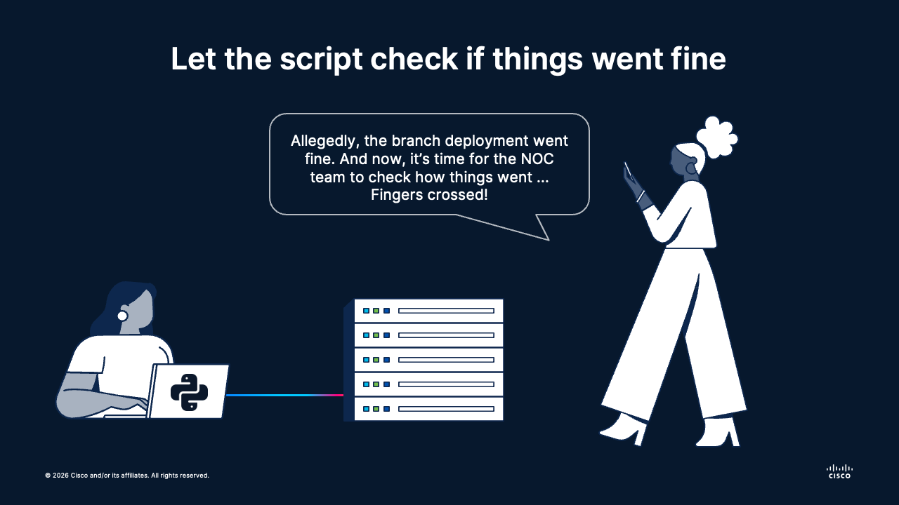

# 🌐 Session 02: CLI Automation with pyATS
Topics: 🧪 Network validation · 🧭 Operational safety · 📊 Structured outputs

---

## 🎯 By the end of this session you will be able to:

| # | Skill |
|:---:|:---|
| 1 | 🔌 Connect to network devices with pyATS using inventory-driven inputs |
| 2 | 📥 Collect operational state with repeatable command and parser workflows |
| 3 | 🧱 Transform raw CLI responses into structured Python data for decisions |
| 4 | 🛡️ Apply small, controlled remediations with pre-check and post-check guardrails |
| 5 | 🗂️ Export execution evidence that can be reused in testing and API pipelines |

---

## 🗺️ What is going on

<div align="center"></div></br>

---

A maintenance window has just finished for 25 branch routers.

Your team has one urgent question: did everything come back healthy, or did hidden drift slip in? The NOC can troubleshoot manually one router at a time, but that does not scale and it does not produce reliable evidence.

For this first block of Session 02, we automate the same workflow engineers already trust from the CLI:

1. Connect over Telnet/SSH.
2. Collect critical operational commands.
3. Detect drift.
4. Apply the smallest safe fix.
5. Re-check and save evidence.

This is where pyATS shines: connection handling, parsing, and validation-friendly data models in one toolkit.

**🏅 Golden rule No.2:**
> Automate reads first, automate writes second, and always prove the result.

---

## 🧰 Why pyATS

[pyATS](https://developer.cisco.com/docs/pyats/) is Cisco's Python framework for network automation and validation. It is a strong bridge from manual operations to structured, test-driven workflows.

Use it when:

- Your environment is still primarily CLI-managed.
- You need repeatable checks with parsed outputs.
- You want to evolve from scripts into formal validation pipelines.

---

## 🗂️ Today's lab

### DevNet Always-on Sandboxes
Cisco DevNet has a platform dedicated to [Always-On Sandbox labs](https://devnetsandbox.cisco.com/DevNet) that you can schedule and use for your own networking experimentation. Best part: it's free! You just need to create an account, find your sandbox, book it, and once it is ready you have access to it via VPN for the time that you scheduled.

In this case, we will use the [Cisco Modeling Labs Sandbox](https://devnetsandbox.cisco.com/DevNet/catalog/cml-sandbox_cml), which provides a Cisco IOS virtual topology with devices that we can interact with via Telnet.


### Virtual Environment
Navigate to the folder `session-02-interaction` and install today's virtual environment:

```bash
cd session-02-interaction/
python3 -m venv .venv
source .venv/bin/activate
pip install -r requirements.txt
```

---

## 🔌 Step 1: Build the pyATS Testbed Inventory

We start with a small testbed file that includes the devices from the [Cisco Modeling Labs Sandbox](https://devnetsandbox.cisco.com/DevNet/catalog/cml-sandbox_cml):

- Device name
- Management IP
- Platform and OS
- Credentials and connection details

```yaml
# inventory.yaml
testbed:
  name: branch_lab

devices:
  R1:
    os: ios
    type: router
    credentials:
      default:
        username: cisco
        password: cisco
    connections:
      cli:
        protocol: telnet
        ip: 10.10.20.171
  R2:
    os: ios
    type: router
    credentials:
      default:
        username: cisco
        password: cisco
    connections:
      cli:
        protocol: telnet
        ip: 10.10.20.172
  SW1:
    os: ios
    type: switch
    credentials:
      default:
        username: cisco
        password: cisco
    connections:
      cli:
        protocol: telnet
        ip: 10.10.20.173
  SW2:
    os: ios
    type: switch
    credentials:
      default:
        username: cisco
        password: cisco
    connections:
      cli:
        protocol: telnet
        ip: 10.10.20.174
```

> **📝 But wait, what is YAML?**

> YAML ("YAML Ain't Markup Language") is a human-readable data serialization format built around indentation and plain key-value pairs.

It is the dominant choice for inventory and configuration specs because:
- **Readable by humans and machines alike**: engineers can edit it by hand without quoting every string or balancing brackets.
- **Language-agnostic**: the same file is consumed unchanged by Python (`PyYAML`) and many other platforms.
- **Natural fit for structured data**: lists of devices, nested groups, and metadata map directly to YAML structures.
- **Separates data from code**: inventory lives in a plain file that non-programmers can review, diff, and version-control.

---

## 📥 Step 2: Run Safe Read-Only Collection

Before changing anything, collect evidence of the state of each device. In this snippet, pyATS connects to devices, executes operational commands, and stores the raw outputs.

```python
# state_collector.py
from pyats.topology import loader

# This is a list of commands we want to collect from the device.
# You can modify this list to include any commands you want to collect.
SHOW_COMMANDS = [
    "show ip interface brief",
    "show ip route summary"
]

def collect_state(device) -> dict[str, dict]:
    """Connect to a device and collect raw outputs.

    Returns:
        A dictionary with raw sections keyed by command.
    """
    device.connect(log_stdout=True)  # Connect to the device and log the connection process.
                                     # The logging is optional, but we want to see the connection process in the output for this demo.

    state = {}  # This is an empty dictionary where we will store the results of our commands.

    for cmd in SHOW_COMMANDS:
        state[cmd] = device.execute(cmd) # The key is the command, and the value is the raw output of the command.
                                         # This will look like: state["show ip interface brief"] = "raw output of the command"

    return state


testbed = loader.load("inventory.yaml")

for name, device in testbed.devices.items():
    # When we loop over the .items() of the devices, we get both the name and the device object.
    # This is useful for printing the name of the device along with the collected state.
    
    print(f"\n🔍 Collecting state from {name}")
    print(f"Device details: {device}\n\n")
    
    state = collect_state(device)
    
    # Let's print the raw results of the commands, one by one
    print(f"------")
    for cmd, output in state.items():
        print(f"\n🔑 Command: {cmd}\n\n")
        print(f"🔖 Output:\n{output}\n")
        print(f"------")
    
    break # Remove this break to collect from all devices in the testbed
          # For the sake of this demo, we will only collect from the first device to keep the output manageable.
```

First of all, because we enabled the log mode in the `connect` function (`log_stdout=True`) - we can see everything that happens behind the curtains:

```bash
2026-04-22 10:13:57,598: %UNICON-INFO: +++ R1 with via 'cli': executing command 'term length 0' +++
term length 0
R1#

2026-04-22 10:13:58,182: %UNICON-INFO: +++ R1 with via 'cli': executing command 'term width 0' +++
term width 0
R1#

...

2026-04-22 10:13:59,259: %UNICON-INFO: +++ R1 with via 'cli': configure +++
config term
Enter configuration commands, one per line.  End with CNTL/Z.
R1(config)#no logging console
R1(config)#line console 0
R1(config-line)#exec-timeout 0
R1(config-line)#line vty 0 4
R1(config-line)#exec-timeout 0
R1(config-line)#end
R1#

...
```

> Notice how pyATS first loads the inventory (the .yaml file) and then handles by itself A LOT of things: credentials, telnet connectivity, enabling config mode and line vty, structured input of the commands, detection of prompt and end of line, etc.

Now, we get the results that we want for each device in a nice output:

```bash
------
🔍 Collecting state from R1
Device details: Device R1, type router

🔑 Command: show ip interface brief

🔖 Output:
Interface              IP-Address      OK? Method Status                Protocol
Ethernet0/0            10.10.10.100    YES TFTP   up                    up      
Ethernet0/1            1.1.1.1         YES TFTP   up                    up      
Ethernet0/2            10.10.20.171    YES TFTP   up                    up      
Ethernet0/3            unassigned      YES TFTP   administratively down down

------

🔑 Command: show ip route summary

🔖 Output:
IP routing table name is default (0x0)
IP routing table maximum-paths is 32
Route Source    Networks    Subnets     Replicates  Overhead    Memory (bytes)
connected       0           4           0           448         1248
static          0           1           0           112         312
application     0           0           0           0           0
internal        3                                               1656
Total           3           5           0           560         3216

------
...
```

---

## 🧞‍♂️ Step 4: Parsing the raw CLI into structured data

Nobody wants to go through raw CLI prints to find the single devation in the configurations. Technically, we could add a regex filter or a TextFSM parser, but the issue is that these are unreliable across vendors and platforms.

With this in mind, pyATS incorporates a powerful tool called [Genie parsers](https://developer.cisco.com/docs/genie-docs/). These are built-in parsers written in Python that we can use in our pyATS scripts for seamlessly transforming raw outputs into Python dictionaries that are much more friendlier with our programming logic.

Let's make some changes in our script to get a parsed result instead of the raw CLI outputs:

```python
# state_collector_parse.py
def collect_state_parsed(device) -> dict[str, dict]:
    """Connect to a device and collect parsed outputs using Genie parsers.

    Returns:
        A dictionary with parsed structured data keyed by command.
    """
    device.connect(log_stdout=False)

    state = {}

    # We will use a special library called tqdm to show a progress bar while we collect the state.
    # This is especially useful when collecting from multiple devices or running many commands, as it gives us visual feedback on the progress of our collection.
    for cmd in tqdm(SHOW_COMMANDS, desc="Parsing commands", unit="cmd"):
        state[cmd] = device.parse(cmd) # Instead of using .execute() to get raw text output, we use .parse() to get structured data.
                                       # The rest of the logic remains the same

    return state
```

Now, instead of the raw outputs, we get nice Python dictionaries that look like this:

```python
{'show ip interface brief': {'interface': {'Ethernet0/0': {'ip_address': '10.10.10.100', 'interface_is_ok': 'YES', 'method': 'TFTP', 'status': 'up', 'protocol': 'up'}, 'Ethernet0/1': {'ip_address': '1.1.1.1', 'interface_is_ok': 'YES', 'method': 'TFTP', 'status': 'up', 'protocol': 'up'}, 'Ethernet0/2': {'ip_address': '10.10.20.171', 'interface_is_ok': 'YES', 'method': 'TFTP', 'status': 'up', 'protocol': 'up'}, 'Ethernet0/3': {'ip_address': 'unassigned', 'interface_is_ok': 'YES', 'method': 'TFTP', 'status': 'administratively down', 'protocol': 'down'}}}, 'show ip route summary': {'vrf': {'default': {'vrf_id': '0x0', 'route_source': {'connected': {'networks': 0, 'subnets': 4, 'replicates': 0, 'overhead': 448, 'memory_bytes': 1248}, 'static': {'networks': 0, 'subnets': 1, 'replicates': 0, 'overhead': 112, 'memory_bytes': 312}, 'application': {'networks': 0, 'subnets': 0, 'replicates': 0, 'overhead': 0, 'memory_bytes': 0}, 'internal': {'networks': 3, 'memory_bytes': 1656}}, 'maximum_paths': 32, 'total_route_source': {'networks': 3, 'subnets': 5, 'replicates': 0, 'overhead': 560, 'memory_bytes': 3216}}}}}
```

Let's parse this into a JSON format to print it prettier:

```python
    for cmd, output in state.items():
        print(f"\n🔑 Command: {cmd}\n\n")
        print(f"🔖 Parsed Output:\n{json.dumps(output, indent=2)}\n") # We use a JSON parser to print these dictionaries pretty
        print(f"------")
```

In the end, we get something like this:

```bash
🔍 Collecting state from R1
Device details: Device R1, type router


Parsing commands: 100%|████████████████████████████████████████████████████████████████████████████████████████████████████████████████████████████████████████████| 2/2 [00:02<00:00,  1.02s/cmd]

🔑 Command: show ip interface brief


🔖 Parsed Output:
{
  "interface": {
    "Ethernet0/0": {
      "ip_address": "10.10.10.100",
      "interface_is_ok": "YES",
      "method": "TFTP",
      "status": "up",
      "protocol": "up"
    },
    "Ethernet0/1": {
      "ip_address": "1.1.1.1",
      "interface_is_ok": "YES",
      "method": "TFTP",
      "status": "up",
      "protocol": "up"
    },
    "Ethernet0/2": {
      "ip_address": "10.10.20.171",
      "interface_is_ok": "YES",
      "method": "TFTP",
      "status": "up",
      "protocol": "up"
    },
    "Ethernet0/3": {
      "ip_address": "unassigned",
      "interface_is_ok": "YES",
      "method": "TFTP",
      "status": "administratively down",
      "protocol": "down"
    }
  }
}

------

🔑 Command: show ip route summary


🔖 Parsed Output:
{
  "vrf": {
    "default": {
      "vrf_id": "0x0",
      "route_source": {
        "connected": {
          "networks": 0,
          "subnets": 4,
          "replicates": 0,
          "overhead": 448,
          "memory_bytes": 1248
        },
        "static": {
          "networks": 0,
          "subnets": 1,
          "replicates": 0,
          "overhead": 112,
          "memory_bytes": 312
        },
        "application": {
          "networks": 0,
          "subnets": 0,
          "replicates": 0,
          "overhead": 0,
          "memory_bytes": 0
        },
        "internal": {
          "networks": 3,
          "memory_bytes": 1656
        }
      },
      "maximum_paths": 32,
      "total_route_source": {
        "networks": 3,
        "subnets": 5,
        "replicates": 0,
        "overhead": 560,
        "memory_bytes": 3216
      }
    }
  }
}

. . .
------
```

Now we can use these data structured to match against what we would expect to have vs. what was really setup in the target devices. This is basically **deviation detection**.

> **Not all platforms + commands are supported**. You might get an error if there is no parser for your specific command. A good practice is to use a try-except block catching the exception type `ParserNotFound` and return the raw CLI results.

For example, the following function tries to parse the CLI outputs of the `show ip interface brief | exclude unassigned` command, to which an error is raised:

```python
# state_collector_parse_handle.py
def collect_state_parsed(device) -> dict[str, dict | str]:
    """Connect to a device and collect parsed outputs using Genie parsers.

    Returns:
        A dictionary keyed by command. Values are parsed structured data when
        a Genie parser is available, or raw CLI output when no parser exists.

    Raises:
        ParserNotFound: Raised by ``device.parse`` when a parser is not
            available for a command. This exception is handled internally and
            the function falls back to raw CLI output for that command.
    """
    device.connect(log_stdout=False)

    state = {}
    for cmd in tqdm(SHOW_COMMANDS, desc="Parsing commands", unit="cmd"):
        try:
            state[cmd] = device.parse(cmd)
        except ParserNotFound as error:                         # If the parser is not found for a command, we catch the ParserNotFound exception
                                                                # and print a warning message. We then fall back to using device.execute(cmd) to get
                                                                # the raw CLI output for that command, which we store in the state dictionary.
            print(f"🚨 Parser not found for '{cmd}': {error}")
            state[cmd] = device.execute(cmd)

    return state
```

This will give us the following output:

```python
🔍 Collecting state from R1
Device details: Device R1, type router


Parsing commands:   0%|                                                                                                                                                    | 0/1 [00:00<?, ?cmd/s]🚨 Parser not found for 'show ip interface brief | exclude unassigned': Could not find parser for 'show ip interface brief | exclude unassigned' under {'os': ['iosxe'], 'platform': ['iol'], 'revision': ['2', '1']}
Parsing commands: 100%|████████████████████████████████████████████████████████████████████████████████████████████████████████████████████████████████████████████| 1/1 [00:00<00:00,  1.02cmd/s]
------

🔑 Command: show ip interface brief | exclude unassigned


🔖 Output:
"Interface              IP-Address      OK? Method Status                Protocol\r\nEthernet0/0            10.10.10.100    YES TFTP   up                    up      \r\nEthernet0/1            1.1.1.1         YES TFTP   up                    up      \r\nEthernet0/2            10.10.20.171    YES TFTP   up                    up      \r\nLoopback100            10.100.100.102  YES manual up                    up"

------
```

> [This official catalogue](https://pubhub.devnetcloud.com/media/genie-feature-browser/docs/#/parsers) enlists all available parsers sorted by platform and command.

> If a parser does not exist for your use case, you can [create a custom parser](https://pubhub.devnetcloud.com/media/pyats-development-guide/docs/writeparser/writeparser.html) using plain Python and then add it to your pyATS deployment.


---

## 🛡️ Step 5: Apply Minimal, Targeted Remediation

Let's say that we need to have a `Loopback Interface` for Telemetry setup in all devices, regardless.

With the python structures that we get from the read-only queries, we can easily detect if this interface exist by checking the 🔑 keys of the `show ip interface brief` dictionary.

No `loopback` key? Or if there is, wrong IP address? Then we need to apply a small remediation: meaning, creating that missing interface.

Fortunately, pyATS can also issue write and commit operations in target devices. The following two functions check if the loopback interface is there or not, and apply the configurations only if required:

```python
# state_collector_remediator.py
def detect_loopback_drift(device: "pyats.devices.Device") -> bool:
    """Detect drift in Loopback100 interface configuration.

    Args:
        device: A connected pyATS device object.

    Returns:
        True if Loopback100 is missing or any of its features don't match the expected configuration, False otherwise.
    """
    parsed_interfaces = collect_state_parsed(device)["show ip interface brief"]     # We get the parsed output of the "show ip interface brief" command,
                                                                                    # which is a dictionary containing an "interface" key with details about all interfaces on the device.
    interface_table = parsed_interfaces.get("interface", {})                        # The get() method is used to safely access the "interface" key, returning an empty dictionary if it doesn't exist.
                                                                                    # This prevents potential KeyError exceptions if the command output doesn't include the expected structure.
                                                                                    
    print(f"🔍 Checking for Loopback100 in the interface table: \n{json.dumps(interface_table, indent=2)}\n") # We print the interface table to see what interfaces are currently present on the device.

    # Check if Loopback100 exists
    if "Loopback100" not in interface_table:
        return True
    
    loopback_config = interface_table["Loopback100"]
    
    # Check if the IP address matches
    if loopback_config.get("ip_address") != "10.100.100.103":
        return True
    
    return False


def remediate_loopback(device: "pyats.devices.Device") -> str:
    """Apply the Loopback100 remediation commands to the connected device.

    Args:
        device: A connected pyATS device object.

    Returns:
        The raw CLI output returned by the device after sending the configuration commands.
    """
    return device.configure(LOOPBACK100_REMEDIATION_COMMANDS)
```

The `remediate_loopback` function applies the following command under the constant `LOOPBACK100_REMEDIATION_COMMANDS`:

```python
LOOPBACK100_REMEDIATION_COMMANDS = [
    "interface Loopback100",
    "ip address 10.100.100.103 255.255.255.255",
    "no shutdown",
]
```

Therefore, when we first run the script, we get the following output:

```python
🔍 Collecting state from R1
Device details: Device R1, type router


Parsing commands: 100%|█████████████████████████████████████████████████████████████████████████████████████████████████████████████████████████████████████████| 1/1 [00:01<00:00,  1.28s/cmd]
🔍 Checking for Loopback100 in the interface table: 
{
  "Ethernet0/0": {
    "ip_address": "10.10.10.100",
    "interface_is_ok": "YES",
    "method": "TFTP",
    "status": "up",
    "protocol": "up"
  },
  "Ethernet0/1": {
    "ip_address": "1.1.1.1",
    "interface_is_ok": "YES",
    "method": "TFTP",
    "status": "up",
    "protocol": "up"
  },
  "Ethernet0/2": {
    "ip_address": "10.10.20.171",
    "interface_is_ok": "YES",
    "method": "TFTP",
    "status": "up",
    "protocol": "up"
  },
  "Ethernet0/3": {
    "ip_address": "unassigned",
    "interface_is_ok": "YES",
    "method": "TFTP",
    "status": "administratively down",
    "protocol": "down"
  },
  "Loopback100": {
    "ip_address": "10.100.100.101",
    "interface_is_ok": "YES",
    "method": "manual",
    "status": "up",
    "protocol": "up"
  }
}

------
⚠️ Drift detected: Loopback100 is missing or doesn't have IP 10.100.100.103. Applying remediation...

✅ Remediation result:
interface Loopback100
ip address 10.100.100.103 255.255.255.255
no shutdown
```

If we run the script a second time, we don't get any drifts:

```python
🔍 Collecting state from R1
Device details: Device R1, type router


Parsing commands: 100%|█████████████████████████████████████████████████████████████████████████████████████████████████████████████████████████████████████████| 1/1 [00:01<00:00,  1.10s/cmd]

------
✅ No drift detected: Loopback100 is present and correctly configured.
```

This way, we managed to detect and remediate small drifts in the device configurations. Everything done in a comprehensive way using pyATS!

---

## 🧠 Concept Mapping

| pyATS concept | Operations equivalent |
|---|---|
| Testbed YAML | Source-of-truth inventory sheet |
| `loader.load()` | Opening the runbook and loading device metadata |
| `device.connect()` | Starting an SSH/Telnet terminal session |
| `device.parse()` | Turning CLI output into a structured checklist using the Genie parsers |
| `device.configure()` | Entering config mode and applying targeted fixes |

---

## 🚀 What's Next

In this lab you automated what engineers already do every day: connect, inspect, parse state, and apply minimal fixes with discipline. That gives immediate operational value and produces structured evidence.

In the next module, we turn these checks into formal pyATS test cases and reusable assertions so verification becomes repeatable and auditable. That is the bridge to **Session 02: Validation Workflows with pyATS AEtest**.
