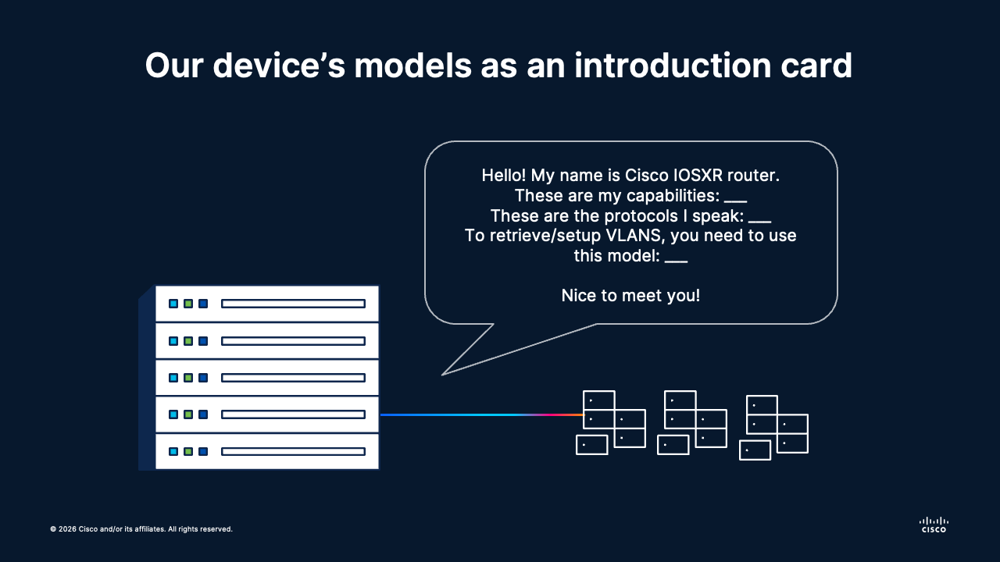
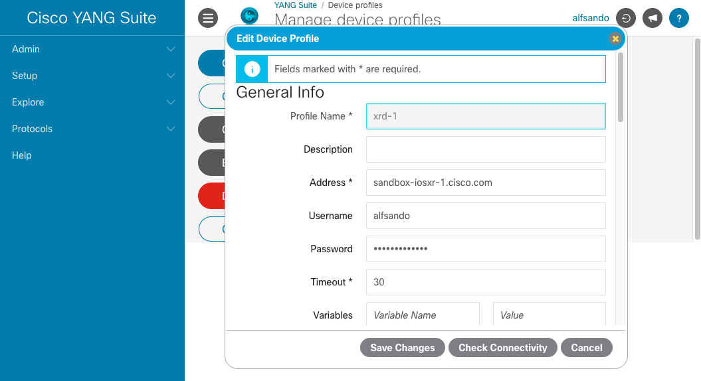
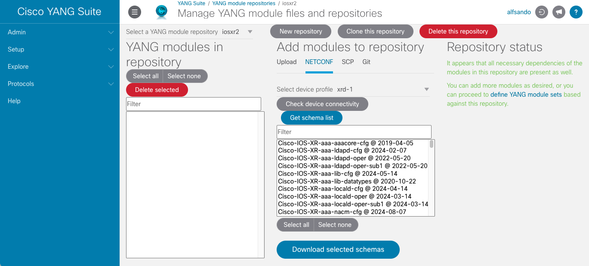
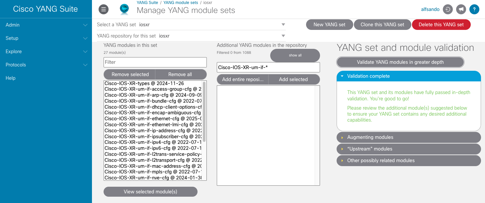
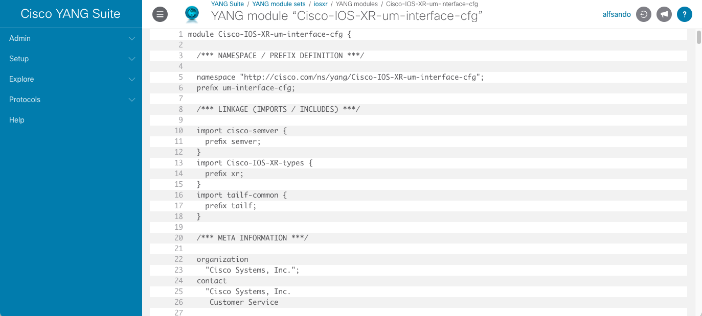
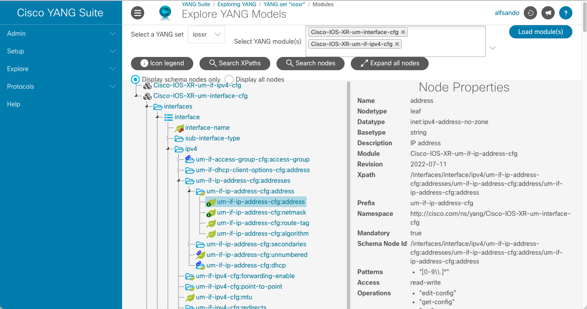

# 🌐 Session 03: Model-Driven Programmability with YANG
Topics: 🧩 YANG language fundamentals · 🛜 Network data models · 🌲 pyang tree exploration · 📦 IOS XR model navigation

---

## 🎯 By the end of this session you will be able to:

| # | Skill |
|:---:|:---|
| 1 | 🧠 Explain what YANG is and why it became the standard data modeling language in modern networks |
| 2 | 🧩 Identify common YANG statements and how they shape model structure |
| 3 | 🏷️ Recognize the most common YANG data types used in operational and configuration models |
| 4 | 🌲 Use pyang to print and read model trees for faster API path discovery |
| 5 | 📡 Navigate Cisco IOS XR YANG model composition using modules, imports, and augment relationships |

---

## 🗺️ What is going on

<div align="center"></div></br>

---

You are no longer just automating commands. You are automating meaning.

In model-driven programmability, devices expose a structured contract that tools can trust. YANG is the language used to define that contract: what data exists, how it is organized, which values are valid, and how clients should interact with it.

For network engineers, this is the shift from "parse whatever the CLI prints today" to "consume stable, typed data designed for machines."

In this first Session 03 lesson, we focus on reading and interpreting those contracts, with Cisco IOS XR as the practical target and `pyang` as the inspection tool.

**🏅 Golden rule No.1:**
> Read the model before writing the automation.

---

## 🧩 What is YANG and why it matters

**YANG** (Yet Another Next Generation) is a data modeling language standardized by the IETF (RFC 7950).

In networking, YANG is commonly used to define:

- 📋 Device configuration data (intended state)
- 📊 Operational state data (observed state)
- 🔄 RPC/action inputs and outputs
- 🔔 Notification/event structures

YANG models are consumed by model-driven interfaces such as:

- `NETCONF` (XML transport)
- `RESTCONF` (HTTP/JSON or XML transport)
- `gNMI` (often with OpenConfig models)

Instead of designing your logic around text output, you design around **schema and paths**.

There are mostly 3 types of models:

- **Vendors-specific**: Are made exclusively for a device/platform
- **IETF-standard**: Basic models that are widely adopted, regardless of the vendor
- **OpenConfig**: Open-source initiative for unifying the data models of the most common components. Adoption varies across vendors

---

## 🧱 Core YANG building blocks

These statements appear constantly in device models. Here is a small practical snippet for each one.

### 📦 `module` / `submodule`

Top-level files that define and split a model.

```yang
module example-interfaces {
	yang-version 1.1;
	namespace "urn:lab:interfaces";
	prefix exif;
}

submodule example-interfaces-types {
	belongs-to example-interfaces { prefix exif; }
}
```

### 🏷️ `namespace` / `prefix`

Unique model identity and shorthand used in references.

```yang
namespace "urn:cisco:iosxr:if";
prefix xr-if;
```

### 🗂️ `container`

Groups related configuration/state, for example device interfaces.

```yang
container interfaces {
	description "Top-level interface config";
}
```

### 📚 `list`

Represents repeated objects such as many interfaces.

```yang
list interface {
	key "name";
	leaf name { type string; }
}
```

### 🍃 `leaf`

Single scalar value, commonly used for settings.

```yang
leaf enabled {
	type boolean;
	description "Administrative state";
}
```

### 🌿 `leaf-list`

Multiple scalar values, useful for lists like NTP servers.

```yang
leaf-list ntp-server {
	type string;
}
```

### 🔀 `choice` / `case`

Mutually exclusive options, for example AAA auth source.

```yang
choice auth-source {
	case local {
		leaf local-user-db { type empty; }
	}
	case tacacs {
		leaf tacacs-group { type string; }
	}
}
```

### ♻️ `grouping` / `uses`

Reusable schema blocks applied in multiple places.

```yang
grouping common-interface-settings {
	leaf mtu { type uint16; }
}

container interface-defaults {
	uses common-interface-settings;
}
```

### 🧷 `typedef`

Creates a reusable custom type with constraints.

```yang
typedef vlan-id {
	type uint16 {
		range "1..4094";
	}
}
```

Quick mental model:

- Structure lives in containers and lists.
- Values live in leaves and leaf-lists.
- Reuse lives in groupings.
- Cross-module extension happens with augment.

---

## 🏷️ Most common YANG data types in networking

You will see these types constantly in IOS XR and OpenConfig models:

| Type | Typical networking usage | Example |
|---|---|---|
| `string` | Hostnames, descriptions, names | `GigabitEthernet0/0/0/1` |
| `boolean` | Feature toggles | `enabled: true` |
| `enumeration` | Controlled keyword options | `admin-status: up` |
| `uint8/16/32/64` | Counters, IDs, timers | `mtu: 9216` |
| `int8/16/32/64` | Signed numeric values | `offset: -20` |
| `decimal64` | Precise fractional values | Utilization or thresholds |
| `identityref` | Reference to a named identity family | Interface or policy type |
| `leafref` | Pointer to another leaf path | ACL or policy attachment by name |
| `union` | Value can match one of several types | Name-or-index style fields |
| `binary` | Encoded payload blobs (less common) | Certificates or opaque data |
| `empty` | Presence-only flags | Feature on/off by presence |

Type restrictions often appear as:

- `range` for numeric bounds
- `length` for strings
- `pattern` for regex-style constraints
- `must` and `when` for semantic validation

These constraints are crucial because they tell your automation what values are valid before the device rejects input.

---

## 🗂️ Today's lab

### DevNet Always-on Sandboxes
In this case, we will use the [IOS XR Always-on](https://devnetsandbox.cisco.com/DevNet/catalog/iosxr-always-on-public_iosxr-always-on-public) device, which provides a Cisco IOSXR shared device with SSH and some other cool features that we will use later on.

> This is a **shared environment**, meaning that multiple users can access it simultaneously. You may see other users' configurations, and they can see yours. Nevertheless, this environment resets to default settings everyday.

### Virtual Environment
Navigate to the folder `session-03-models` and install today's virtual environment:

```bash
cd session-03-models/
python3 -m venv .venv
source .venv/bin/activate
pip install -r requirements.txt
```

> This `pip install` will take a bit longer than the previous ones, as we are installing a much more complex tool this time: **Cisco Yang Suite**

---

## 🌲 Exploring models with Cisco Yang Suite

We just installed an open-source platform provided by Cisco called **Yang Suite**. This is a graphical tool that makes it much easier to explore, visualize, and understand YANG models directly from your network devices. Unlike command-line tools, Yang Suite provides an interactive interface to:

- 📥 Fetch models directly from live devices
- 🌳 Browse tree structures visually
- 🔍 Search and filter models by name or type
- 📋 View detailed leaf constraints and descriptions
- 🧩 Understand augmentations and imports visually

For more information, [check the official repository](https://github.com/CiscoDevNet/yangsuite.git).


### Step 1: Setup Yang Suite

In your terminal with the active virtual environment, issue the following command:

```bash
yangsuite
```

This will trigger an assistant which will guide you through the setup process.

Once it is done, open your browser to `http://localhost:8480`

### Step 2: Create a Device Profile

1. In Yang Suite, navigate to **Setup → Device Profiles**
2. Click **Add Device**
3. Fill in the connection details:
   - **Profile Name**: Any given name for your device
   - **Address**: Use the IOS XR sandbox IP. In this case `sandbox-iosxr-1.cisco.com`
   - **Username & Password**: Your sandbox credentials

4. Tick on the `Device supports NETCONF` and `Skip SSH key validation for this device` boxes of the **NETCONF** section. Also verify the following pre-populated information:

   - **NETCONF Port**: 830
   - **Address**: Use the IOS XR sandbox IP. In this case `sandbox-iosxr-1.cisco.com`
   - **Username & Password**: Your sandbox credentials



> **What is `NETCONF` anyhow?** This is a model-driven protocol. We'll check it in detail in the next lecture!

5. Afterwards, click the `Check Connectivity` button. After some time, it shall display the message `✅ NETCONF`. You can dismiss any other errors, as we are focusing now on this protocol.

6. Click **Save**

### Step 3: Create a new model repository

1. Navigate to **Setup → YANG files and repositories** section
2. Click on **New repository**. Add a name
3. In the section **Add modules to repository**, click on **NETCONF**
2. Click the drop-down for **Select device profile** Your newly connected device shall appear in the list
3. Select it. Then click on **Get schema list**. This will present you with all the models available inside of the device
4. Click **Select all**, and then **Download selected schemas**. This will take some time



### Step 4: Create a module set

1. Navigate to **Setup → YANG module sets** section
2. Click on **New YANG set**. Select from the picklist the repository that you created before
3. In the Filter, type `interface`: we want to fetch the models that have to do with interfaces configs!
4. Select them. Then click **Add selected**.
5. A warning should appear on the right side, under the `Missing dependencies` section. Click on **Locate and add missing dependencies**
6. Now click **Validate YANG modules in greater depth**



7. If you click on any of the models and then on **View Selected Model**, you can see the full raw YANG text:



#### 🔗 `import` (when one module needs another)

Modules often depend on definitions from other modules. For example, the model shown above imports `cisco-semver`, `Cisco-IOS-XR-types` and `tailf-common`. Without these, we don't have the full picture. That's why Yang Suite raises the warning, detects the dependencies and imports them into our module set:

```yang
module Cisco-IOS-XR-um-interface-cfg {
  /*** NAMESPACE / PREFIX DEFINITION ***/
  namespace "http://cisco.com/ns/yang/Cisco-IOS-XR-um-interface-cfg";
  prefix um-interface-cfg;
  /*** LINKAGE (IMPORTS / INCLUDES) ***/
  import cisco-semver {
    prefix semver;
  }
  import Cisco-IOS-XR-types {
    prefix xr;
  }
  import tailf-common {
    prefix tailf;
  }
  . . .
```

### Step 5: Read and Navigate Trees

1. Navigate to **Explore → YANG** section
2. On **Select a YANG set**, pick the set that you just created
3. On **Select YANG module(s)**, pick `Cisco-IOS-XR-um-interface-cfg` and `Cisco-IOS-XR-um-if-ipv4-cfg`, and then click the button **Load Modules**



Yang Suite displays trees interactively:

- **Expand/collapse** nodes by clicking the arrow icons
- **Highlight leaves** with strict types, constraints, or references
- **Hover** over descriptions to see full documentation
- **Filter** by keyword to find specific branches quickly
- **Export** trees as text or JSON for documentation

> We imported both `Cisco-IOS-XR-um-interface-cfg` and `Cisco-IOS-XR-um-if-ipv4-cfg` because the first depends on the second to show the very complex `ipv4` configurations. Without this import, `ipv4` would just show an empty container. It is `Cisco-IOS-XR-um-if-ipv4-cfg` who has all the options available for our interfaces!

---

#### 🧭 What is an XPath?

An XPath is the exact hierarchical path to a node inside the YANG data tree. You can think of it as the full "address" of a specific field.

From the modules we explored in Yang Suite (`Cisco-IOS-XR-um-interface-cfg` + `Cisco-IOS-XR-um-if-ipv4-cfg`), the XPath for an interface IPv4 address is:

```text
/interfaces/interface/ipv4/um-if-ip-address-cfg:addresses/um-if-ip-address-cfg:address/um-if-ip-address-cfg:address
```

Why this matters: this is the path you target when reading or configuring that value through model-driven APIs (which we will do very soon!)

---

## 🧠 Concept Mapping

| YANG concept | Networking automation meaning | Visible in Yang Suite |
|---|---|---|
| `module` | Schema package for a domain | Module list in left panel |
| `container` | Folder-like grouping of related settings/state | Expandable tree node (no marker) |
| `list` + `key` | Repeated resource collection and unique selector | Node with `*` marker and [key] notation |
| `leaf` type constraints | Input validation contract | Shown in leaf properties panel |
| Tree visualization | Fast blueprint view before coding API calls | **Interactive Yang Suite interface** |

---

## 🚀 What's Next

Now that you can read YANG trees and identify precise XPaths in Yang Suite, the next step is to use those paths in a real protocol workflow.

In the next lesson, **NETCONF Essentials**, we will first understand the protocol exchange itself (session establishment, capabilities, RPC operations, and replies), then move into hands-on Python automation with `ncclient`.

That is the bridge to **Session 03 Lesson 02: NETCONF Essentials with ncclient**.
