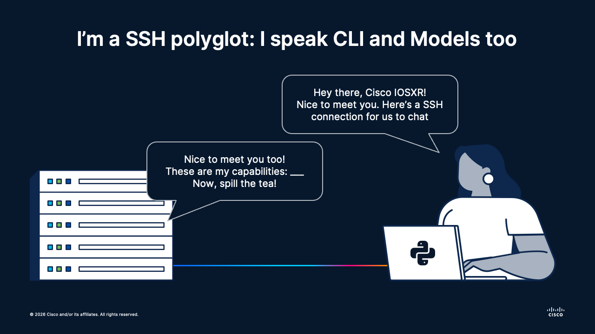
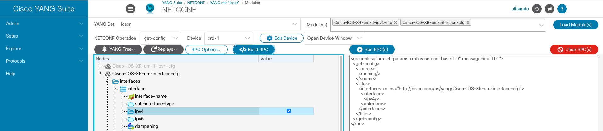
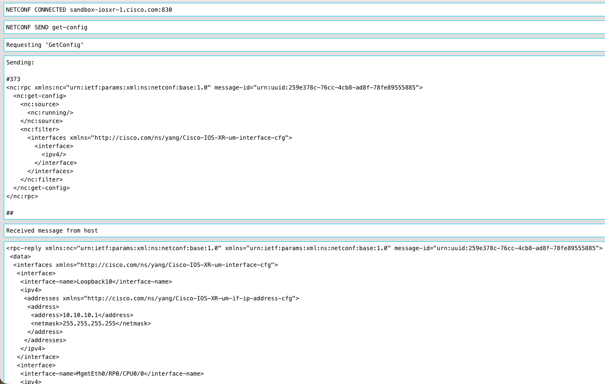
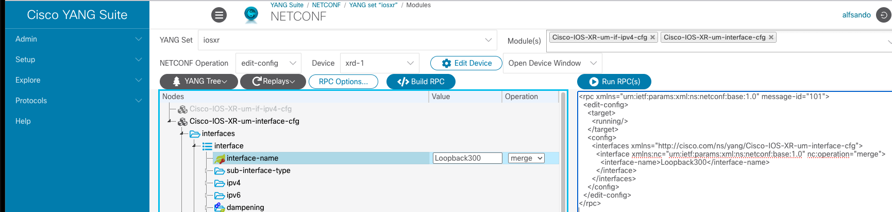

# 🌐 Session 03 | Lesson 02: NETCONF Essentials with ncclient
Topics: 🛰️ NETCONF protocol flow · 🔐 SSH transport and capabilities · 🐍 Python ncclient workflows · 🧭 Yang Suite XPath to RPC mapping

---

## 🎯 By the end of this session you will be able to:

| # | Skill |
|:---:|:---|
| 1 | 🛰️ Explain the NETCONF message flow (`<hello>`, `<rpc>`, `<rpc-reply>`, `<close-session>`) |
| 2 | 🔐 Establish a NETCONF session to IOS XR using `ncclient` over SSH/830 |
| 3 | 📖 Read loopback interface configuration/state using subtree filters derived from Yang Suite exploration |
| 4 | ✍️ Create or update loopback IPv4 configuration with `edit-config` using model-aligned XML payloads |
| 5 | ✅ Validate configuration results by reading back and confirming expected values |

---

## 🗺️ What is going on

<div align="center"></div></br>

---

In the previous lesson, you learned how to navigate YANG modules in Yang Suite and find precise paths to the data you care about.

Now we cross the bridge from model reading to model execution.

NETCONF is the protocol that lets us ask devices for model-structured data and push model-structured configuration in a safe, transaction-oriented way. Instead of scraping output, we exchange RPC messages over SSH and get deterministic XML responses.

**🏅 Golden rule No.2:**
> Build your NETCONF payload from the model path first, then send the RPC.

---

## 🛰️ NETCONF protocol essentials

NETCONF is an RPC-based protocol (RFC 6241) typically carried over SSH on TCP port `830`.

For exchanging messages between a client and a target device using this protocol, NETCONF must be enabled in the device itself (more than usual it is not enabled by default).

Then, the following process takes place:

```text
+-----------------------------------+                          +-----------------------------------+
| 🧑‍💻 NETCONF Client                 |                          | 🛜 IOS XR Device                  |
| (Python, Yang Suite, etc.)        |                          | (NETCONF server)                  |
+-----------------------------------+                          +-----------------------------------+
                 |                                                              |
                 |  🔐 TCP/SSH connect to port 830                              |
                 |------------------------------------------------------------->|
                 |                                                              |
                 |  👋 <hello>                                                  |
                 |    capabilities:                                             |
                 |    - base:1.0 / base:1.1                                     |
                 |    - :writable-running, :candidate, :validate, ...           |
                 |------------------------------------------------------------->|
                 |                                                              |
                 |                                      👋 <hello>              |
                 |                                      session-id=NNN          |
                 |                                      server capabilities     |
                 | <------------------------------------------------------------|
                 |                                                              |
                 |  📖 <rpc message-id="101"><get-config/></rpc>                |
                 |------------------------------------------------------------->|
                 |                                                              |
                 |  📦 <rpc-reply message-id="101"><data>...</data></rpc-reply> |
                 | <------------------------------------------------------------|
                 |                                                              |
                 |  ✍️ <rpc message-id="102"><edit-config/></rpc>               |
                 |------------------------------------------------------------->|
                 |                                                              |
                 |  ✅ <rpc-reply message-id="102"><ok/></rpc-reply>            |
                 | <------------------------------------------------------------|
                 |                                                              |
                 |  🧾 <rpc message-id="103"><commit/></rpc>  (if candidate)    |
                 |------------------------------------------------------------->|
                 |                                                              |
                 |  ✅ <rpc-reply message-id="103"><ok/></rpc-reply>            |
                 | <------------------------------------------------------------|
                 |                                                              |
                 |  👋 <close-session/>                                         |
                 |------------------------------------------------------------->|
                 |                                                              |
+-----------------------------------+                          +-----------------------------------+
```

At a practical level, every session follows this lifecycle:

1. **Transport established** over SSH.
2. **Capability exchange** with `<hello>`.
3. **Operations** via `<rpc>` (for example `get-config`, `get`, `edit-config`, `commit`).
4. **Structured response** in `<rpc-reply>`.
5. **Session closure** with `<close-session>`.

NETCONF actually has 3 different datastores:

- `running`: active device configuration.
- `candidate`: staging area (commit required).
- `startup`: boot-time saved config (for disaster recovery mostly).

---

## 🗂️ Today's lab

We will reuse the same DevNet Sandbox Cisco IOSXR device + virtual environment from the previous module:

```bash
cd session-03-models
source .venv/bin/activate
cd 02-netconf-essentials
```

---

## 🐍 Step 1: Open a NETCONF session and inspect capabilities

`ncclient` is a Python library that provides a high-level client interface for opening NETCONF sessions and sending RPC operations like `get-config`, `edit-config`, and `commit`.

This lesson's script reads connection settings from environment variables instead of hardcoding credentials.

```python
# netconf_capabilities.py
import os
from ncclient import manager

load_dotenv(".env")

HOST = os.getenv("NETCONF_HOST")
PORT = int(os.getenv("NETCONF_PORT"))
USERNAME = os.getenv("NETCONF_USERNAME")
PASSWORD = os.getenv("NETCONF_PASSWORD")

with manager.connect(
    host=HOST,
    port=PORT,
    username=USERNAME,
    password=PASSWORD,
    hostkey_verify=False,
    allow_agent=False,
    look_for_keys=False,
    timeout=30,
) as m:
    print(f"✅ Connected! Session ID: {m.session_id}")
    print("🙌🏽 Server capabilities (a looong list):")
    for capability in m.server_capabilities:
        print(f"- {capability}")
```

> But hey, what is that **os.getenv()** thing?

**Environment variables** are key-value pairs stored in your shell's process environment, outside of any source file. They are the standard way to pass secrets (passwords, tokens) and host-specific settings to a program without hardcoding them, so credentials never end up committed in Git (which would be **catastrophic**).

In this lesson, `.env.example` is a template that lists every variable the script expects. To use it:

1. Copy it to `.env`:

```bash
cp .env.example .env
```

2. Fill in your actual sandbox values in `.env`
3. Run the script as usual:

```bash
python netconf_capabilities.py
```

> Never commit `.env` to your Git! Only commit `.env.example` (with placeholder values) as documentation for other users.

Now, back to our `ncclient`: What `manager.connect` does is to establish a SSH session with our target device and send the initial `<hello/>` message, to which the device replies with another `<hello/>`, including a list of capabilities (aka. all the models that this device supports!)

---

## 📖 Step 2: Read interfaces data with `get-config`

What we want to do next is to read the `interfaces` configurations from the `running` datastore - this is, the interfaces that are setup now.

For this, what we need to do is to **filter** the interfaces part of the `running` configuration using, yes you guessed it right, models.

The **Cisco Yang Suite** can help us to determine the exact model part that we need to use to filter out our interfaces. To do this, follow the next steps:

1. Navigate to **Protocols - NETCONF**
2. In the **YANG Set** drop-down, select your previously created set
3. In the **Module(s)** part, pick `Cisco-IOS-XR-um-interface-cfg` and `Cisco-IOS-XR-um-if-ipv4-cfg`, and then click the button **Load Modules**
4. In the **NETCONF Operation** part, select `get-config`
5. In the **Device** part, select your target Sandbox device

> You might get a `Bad Gateway` error here. Do not panic, this is a known bug

6. Expand the `Cisco-IOS-XR-um-interface-cfg` tree all the way down to `ipv4` and tick the box in the **Value** column
7. Click the button **Build RPC**. This will give you the filter that we will use on the right side of the screen:



8. To verify that you get the information that you want with this filter, click the **Run RPC(s)** button:



Let's pick then that XML filter and use it in our Python script to get all the interfaces:

```python
# netconf_get_running.py
filter_xml = f"""
<interfaces xmlns="http://cisco.com/ns/yang/Cisco-IOS-XR-um-interface-cfg">
    <interface>
        <ipv4/>
    </interface>
</interfaces>
"""

with manager.connect(
    host=HOST,
    port=PORT,
    username=USERNAME,
    password=PASSWORD,
    hostkey_verify=False,
    allow_agent=False,
    look_for_keys=False,
    timeout=30,
) as m:
    reply = m.get_config(source="running", filter=("subtree", filter_xml))
    print(reply.xml)
```

This effectively gives us the interfaces configs in a nice XML:

```xml
<rpc-reply message-id="urn:uuid:7466e9b7-3e0e-4594-a08d-6f2624ff9703" xmlns:nc="urn:ietf:params:xml:ns:netconf:base:1.0" xmlns="urn:ietf:params:xml:ns:netconf:base:1.0">
 <data>
  <interfaces xmlns="http://cisco.com/ns/yang/Cisco-IOS-XR-um-interface-cfg">
   <interface>
    <interface-name>Loopback10</interface-name>
    <ipv4>
     <addresses xmlns="http://cisco.com/ns/yang/Cisco-IOS-XR-um-if-ip-address-cfg">
      <address>
       <address>10.10.10.1</address>
       <netmask>255.255.255.255</netmask>
      </address>
     </addresses>
    </ipv4>
   </interface>
   <interface>
    <interface-name>MgmtEth0/RP0/CPU0/0</interface-name>
    <ipv4>
     <addresses xmlns="http://cisco.com/ns/yang/Cisco-IOS-XR-um-if-ip-address-cfg">
      <address>
       <address>10.10.20.101</address>
       <netmask>255.255.255.0</netmask>
      </address>
     </addresses>
    </ipv4>
   </interface>
   <interface>
    <interface-name>GigabitEthernet0/0/0/0</interface-name>
    <ipv4>
     <addresses xmlns="http://cisco.com/ns/yang/Cisco-IOS-XR-um-if-ip-address-cfg">
      <address>
       <address>192.168.1.10</address>
       <netmask>255.255.255.252</netmask>
      </address>
     </addresses>
    </ipv4>
   </interface>
   <interface>
    <interface-name>GigabitEthernet0/0/0/1</interface-name>
    <ipv4>
     <addresses xmlns="http://cisco.com/ns/yang/Cisco-IOS-XR-um-if-ip-address-cfg">
      <address>
       <address>192.168.1.14</address>
       <netmask>255.255.255.252</netmask>
      </address>
     </addresses>
    </ipv4>
   </interface>
  </interfaces>
 </data>
</rpc-reply>
```

> Tip: Cisco Yang Suite is your friend! Rely on it for building your filters and testing them before bringing into your scripts.

---

## ✍️ Step 3: Create loopback IPv4 with `edit-config`

Great! Now that we know how does an interface _look like_ based on the models, its time to create our own.

What we will do is the following: 🔧 Change `candidate-config` -> 🧪 Test the changes -> ⤵️ If OK, commit to `running-config`:

```python
# netconf_commit.py

config_xml = f"""
<config>
  <interfaces xmlns="http://cisco.com/ns/yang/Cisco-IOS-XR-um-interface-cfg">
        <interface>
            <interface-name>Loopback300</interface-name>
            <ipv4>
                <addresses xmlns="http://cisco.com/ns/yang/Cisco-IOS-XR-um-if-ip-address-cfg">
                    <address>
                        <address>10.10.35.1</address>
                        <netmask>255.255.255.255</netmask>
                    </address>
                </addresses>
            </ipv4>
            <description>
                Telemetry
            </description>
        </interface>
    </interfaces>
</config>
"""

with manager.connect(
    host=HOST,
    port=PORT,
    username=USERNAME,
    password=PASSWORD,
    hostkey_verify=False,
    allow_agent=False,
    look_for_keys=False,
    timeout=30,
) as m:
    test = m.edit_config(config_xml, target='candidate', format='xml')
    print(f"✅ Edit-config response: {test}\n\n")
    
    if test.ok:
        commit = m.commit()
        print(f"✅ Commit response: {commit}\n")
```

You can see that we get a `</ok>` reply for both the candidate validation and the actual commit, resulting in the new interface being setup in the device:

```xml
✅ Edit-config response: <?xml version="1.0"?>
<rpc-reply message-id="urn:uuid:ad8ade20-ad97-4fce-a802-8c6048185153" xmlns:nc="urn:ietf:params:xml:ns:netconf:base:1.0" xmlns="urn:ietf:params:xml:ns:netconf:base:1.0">
 <ok/>
</rpc-reply>

✅ Commit response: <?xml version="1.0"?>
<rpc-reply message-id="urn:uuid:32d61672-bdce-422a-8903-30bc2334e18d" xmlns:nc="urn:ietf:params:xml:ns:netconf:base:1.0" xmlns="urn:ietf:params:xml:ns:netconf:base:1.0">
 <ok/>
</rpc-reply>
```

If you check the interfaces using either the `netconf_get_running.py` script or Cisco Yang Suite, you will find the new interface.

---

## 🔥 Step 4: Deleting the interface with `edit_config`

The trick to delete any configuration is actually pretty simple: you just need to pass the XML payload you want to get rid of, and change the `operation` to `delete`.

However, there might be a couple of namespaces that change and such. For that reason, it is a good idea to rely yet again on **Cisco Yang Suite** to generate the payload for you:

1. Navigate to **Protocols - NETCONF**
2. In the **YANG Set** drop-down, select your previously created set
3. In the **Module(s)** part, pick `Cisco-IOS-XR-um-interface-cfg` and `Cisco-IOS-XR-um-if-ipv4-cfg`, and then click the button **Load Modules**
4. In the **NETCONF Operation** part, select `edit-config`
5. In the **Device** part, select your target Sandbox device
6. Expand the `Cisco-IOS-XR-um-interface-cfg` tree all the way down to `interface-name`
7. In the **Value** column, input the name of the interface to delete
8. In the **Operation** column, select any value
9. Click the button **Build RPC**. This will give you the filter that we will use on the right side of the screen:



> Eventhough the option `delete` does not exist, we will take this payload and just replace the value in `nc:operation` for that one

```python
# netconf_delete.py

delete_config_xml = f"""
<config>
    <interfaces xmlns="http://cisco.com/ns/yang/Cisco-IOS-XR-um-interface-cfg">
    <interface xmlns:nc="urn:ietf:params:xml:ns:netconf:base:1.0" nc:operation="delete">
        <interface-name>Loopback300</interface-name>
    </interface>
    </interfaces>
</config>
"""
```

By following the same logic as with the script for pushing changes, we are actually deleting this interface.

---

## 🧠 Concept Mapping

| NETCONF concept | Practical meaning in this lesson |
|---|---|
| `<hello>` | Capability negotiation and session setup |
| `<rpc>` | Operation request (`get-config`, `edit-config`, `commit`) |
| `<rpc-reply>` | Structured response (`<data>` or `<ok/>`) |
| Subtree filter | NETCONF read query built from Yang Suite model hierarchy |
| `edit-config` merge | Safe update of only targeted config nodes |
| `candidate` + `commit` | Transaction-style staging and apply |

---

## 🚀 What's Next

Now that you can map Yang Suite paths into real NETCONF reads and writes, the next step is to compare NETCONF workflows with HTTP-based workflows using the same YANG-backed data models.

That is the bridge to **Session 03 Lesson 03: API Essentials with RESTCONF (same data, different protocol ergonomics)**.
