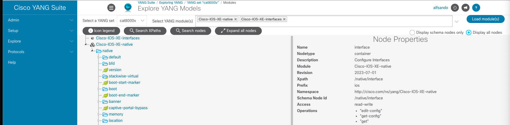
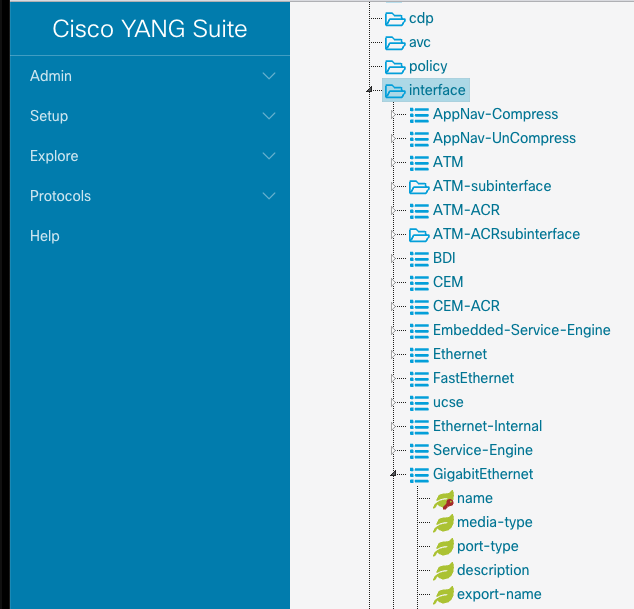

# 🌐 Session 03 | Lesson 03: API Essentials with RESTCONF and Python requests
Topics: 🌍 REST fundamentals · ☁️ Weather API mental model · 🔁 HTTP methods and status codes · 🛰️ RESTCONF with YANG-modeled data

---

## 🎯 By the end of this session you will be able to:

| # | Skill |
|:---:|:---|
| 1 | 🌍 Explain what REST is and why resources + HTTP verbs are the core abstraction |
| 2 | ☁️ Map a real Weather App flow to API requests and responses |
| 3 | 🔁 Use `GET`, `POST`, `PUT`, `PATCH`, and `DELETE` correctly in API conversations |
| 4 | 🛰️ Read IOS XR YANG-modeled interface data with RESTCONF using `requests` |
| 5 | ✍️ Create and remove a loopback interface over RESTCONF and validate results |

---

## 🗺️ What is going on

<div align="center"></div></br>

---

In the previous lesson, you used NETCONF RPCs to read and modify model-driven data in IOS XR.

Now we approach the same YANG-backed data using an HTTP style: `RESTCONF`.

This lesson is important because many teams already know **REST** from web and cloud APIs. `RESTCONF` gives you that same resource-oriented pattern for network configuration and operational data.

**🏅 Golden rule No.3:**
> Build the resource path from the YANG model first, then choose the right HTTP method.

---

## 🌍 But what is REST?

`REST`, or _Representational State Transfer_, is an architectural style for APIs where:

1. Data is modeled as **resources** (for example: `/users/42`, `/weather/current`, `/orders/abc123`).
2. Resources are identified by **URIs**.
3. Clients operate on resources using standard **HTTP methods**.
4. Servers return **representations** (usually JSON, sometimes XML).
5. Interactions are usually **stateless** (each request contains what the server needs).

Think of REST as: _"I know where the thing lives `(URI)`, and I know what I want to do `(HTTP method)`."_

> 💡 This diagram explains how an HTTPS request to an API server works:

```text

  🧑‍💻 Client Application           🔒 HTTPS / port 443          🖥️  API Server
 +------------------------+                                  +------------------------+
 | mobile / web / script  |  ----  GET /resource/123  ---->  |   (resource owner)     |
 |                        |  <---  200 OK + JSON body  ----  |                        |
 +------------------------+                                  +------------------------+
          |                                                            |
          +---- 🖼️  Renders or acts on the received representation ----+

```

Imagine a Weather App on your phone. It does not "know" the weather by itself. It asks a weather API for resources like current conditions or forecast:

```text

  📱 Weather App (your phone)                          ☁️  Weather API Server
 +---------------------------+                        +---------------------------+
 |                           |                        | /v1/current               |
 |  1️⃣  Current conditions?  |  -- GET /v1/current -->| /v1/forecast              |
 |                           |  <-- 200 OK + JSON --- |                           |
 +---------------------------+                        +---------------------------+
           |
           |   🌡️  { temp: 29°C, humidity: 72%, conditions: "Partly Cloudy" }
           |
           |
 +---------------------------+                         +---------------------------+
 |                           |                         |  /v1/current              |
 |  2️⃣  5-day forecast?      |  -- GET /v1/forecast -->|  /v1/forecast             |
 |                           |  <-- 200 OK + JSON ---  |                           |
 +---------------------------+                         +---------------------------+
           |
           |   📅  { daily: [ Mon, Tue, Wed, Thu, Fri ] }
           |
           v
    🖼️  UI renders "Now" + "Next 5 days"

```

Example JSON response:

```json
{
  "city": "Miami",
  "current": {
	"temperature_c": 29,
	"humidity_pct": 72,
	"conditions": "Partly Cloudy"
  }
}
```

The same pattern applies in network automation:

- 🛜 The device exposes resources (interfaces, routes, BGP neighbors).
- 🐍 Your Python script is the client.
- 🔧 You use HTTP methods to read or modify those resources.

---

## 🔁 HTTP request types you must know

These are the core methods you will use constantly:

| Method | Typical meaning  | Example |
|---|---|---|
| 📖 `GET` | Read a resource | _Read interface config_ |
| 🆕 `POST` | Create under a collection | _Create new loopback_ |
| 🔄 `PUT` | Replace resource representation | _Replace full interface object_ |
| 🩹 `PATCH` | Partial update | _Change only description_ |
| 🗑️ `DELETE` | Remove a resource | _Delete loopback_ |

Typical status codes:

- ✅ `200 OK`: Read/update worked and response body is returned.
- 🆕 `201 Created`: a new resource was created.
- 📭 `204 No Content`: operation worked, no response body.
- ❌ `400 Bad Request`: payload/path/method issue.
- 🔐 `401 Unauthorized`: credentials missing or invalid.
- 🔍 `404 Not Found`: target resource path does not exist.
- ⚡ `409 Conflict`: operation conflicts with current server state.


```text
🤔 Client intention  ──▶  🔧 HTTP method  ──▶  🔗 URI (resource path)  ──▶  📦 Status code + body
```

---

## 🛰️ Enter RESTCONF (REST + YANG models)

`RESTCONF` (RFC 8040) is an HTTP-based protocol to access YANG-modeled data.

Instead of `NETCONF` RPC envelopes (`<rpc>`, `<rpc-reply>`), you operate directly on **model paths** using standard HTTP URIs. No SSH session, no XML envelope, just `requests.get()`.

Common base path on IOS XR:

```text
https://<device>/restconf/data/
```

Lifecycle compared to `NETCONF`:

| 🛰️ NETCONF mindset | 🌐 RESTCONF mindset |
|---|---|
| Open session + `<hello>` | HTTPS request with credentials |
| `<rpc> get-config` | `GET /restconf/data/...` |
| `<rpc> edit-config` | `POST` / `PUT` / `PATCH /restconf/data/...` |
| `commit` (when candidate used) | Applied immediately per HTTP operation |
| `<rpc-reply>` with XML | HTTP status code + JSON or XML body |

> 💡 The big idea is still the same: **model path first**. Only the transport ergonomics change.

---

## 🗂️ Today's lab

### DevNet Always-on Sandboxes
In this case, we will use the [IOS XE on Cat8kv](https://devnetsandbox.cisco.com/DevNet/catalog/IOS%20XE%20on%20Cat8kv_ios-xe-cat-8kv) sandbox.

This one provides a series of devices, including a Catalyst 8000v running IOSXE which is enabled with NETCONF and RESTCONF at the same time. Given that it has fixed credentials, we will hardcode them in all our scripts for now.

### Virtual Environment
Navigate to the folder `session-03-models` to activate the existing virtual environment:

```bash
cd session-03-models
source .venv/bin/activate
cd 03-api-essentials-restconf
```

---

## 🔌 Verify RESTCONF connectivity

Before we start reading model data, let's verify that RESTCONF is reachable and your credentials are correct.

> `requests` is a Python HTTP client library used to call APIs with methods like `GET`, `POST`, `PUT`, `PATCH`, and `DELETE`, while handling headers, authentication, timeouts, and responses in a clean way.

```python
# restconf_connectivity_check.py
import requests

# Keep output clean when verify=False is used in sandbox environments.
requests.packages.urllib3.disable_warnings()

HOST = "10.10.20.48"
PORT = 443
USERNAME = "developer"
PASSWORD = "C1sco12345"

BASE_URL = f"https://{HOST}:{PORT}/restconf/data"

response = requests.get(
    BASE_URL,
    headers={"Accept": "application/yang-data+json"},
    auth=(USERNAME, PASSWORD),
    verify=False,
    timeout=15,
    stream=True,
)

print(f"✅ Status: {response.status_code}")
response.raise_for_status()
print("🌐 RESTCONF connectivity/auth looks good!")
response.close()
```

In this script, we are basically sending a HTTPS request to the API URL `https://10.10.20.48:443/restconf/data` using the credentials `developer/C1sco12345`.

This is a **GET** request, as noted when using the function `requests.get()`, given that we are just **querying** information - we are NOT changing any configuration in the device.

Run the script:

```bash
python restconf_connectivity_check.py
```

If you get `200 OK`, you are ready for data operations:

```bash
✅ Status: 200
🌐 RESTCONF connectivity/auth looks good!
```

> Remember, **200 is good!**

---

## 🧩 Step 1: Getting our models for interfaces

Our Sandbox device is also enabled with NETCONF, meaning that we can use the **Cisco Yang Suite** the exact same way as we did in the previous lesson to identify the models that we need to retrieve and setup interfaces.

The only difference is that, this time, we **DON'T want a RPC XML payload**, but rather **a XPath**, which will be our target URL.

1. Repeat the same steps as in the last lesson for creating a new device profile, module repository, and module set for this device.
2. Navigate to **Explore - YANG**
3. Select the models `Cisco-IOS-XE-native` and `Cisco-IOS-XE-interfaces`. The click on **Load Modules**

> The native configurations of IOSXE, including its interfaces, sit on the model `Cisco-IOS-XE-native`

4. Expand the model `Cisco-IOS-XE-native`. Navigate down all the way to `interface`





Notice that `interface` is a container where all the interfaces grouped by type exist, and it has the following crucial metadata:

- **module**: `Cisco-IOS-XE-native`
- **xpath**: `/native/interface`

Keep this in mind for the next section.


## 📖 Step 2: Read interface data with GET

When we want to query a specific part of a model with a `GET` HTTPS request, we use the following URL format:

```url
https://<device>/restconf/data/<module>:<xpath>
```

In our case, to get all the interfaces we populate the URL as follows:

```url
https://10.10.20.48:443/restconf/data/Cisco-IOS-XE-native:native/interface
```

Now, let's put it to test in this script:

```python
# restconf_get_interfaces.py
import json
import requests

# Keep output clean when verify=False is used in sandbox environments.
requests.packages.urllib3.disable_warnings()

HOST = "10.10.20.48"
PORT = 443
USERNAME = "developer"
PASSWORD = "C1sco12345"

BASE_URL = f"https://{HOST}:{PORT}/restconf/data"

headers = {
	"Accept": "application/yang-data+json"
}

resource = "Cisco-IOS-XE-native:native/interface"
url = f"{BASE_URL}/{resource}"

response = requests.get(
	url,
	headers=headers,
	auth=(USERNAME, PASSWORD),
	verify=False,
	timeout=30,
)

print(f"Status: {response.status_code}")
print(json.dumps(response.json(), indent=2))
```

If the request is successful, we get the JSON content of the response, which is actually the interfaces of the device:

```json
Status: 200
{
  "Cisco-IOS-XE-native:interface": {
    "GigabitEthernet": [
      {
        "name": "1",
        "description": "MANAGEMENT INTERFACE - DON'T TOUCH ME",
        "ip": {
          "address": {
            "primary": {
              "address": "10.10.20.48",
              "mask": "255.255.255.0"
            }
          }
        },
        "logging": {
          "event": {
            "link-status": [
              null
            ]
          }
        },
        "access-session": {
          "host-mode": "multi-auth"
        },
        "Cisco-IOS-XE-ethernet:negotiation": {
          "auto": true
        }
      },
      {
        "name": "2",
        "description": "Network Interface",
        "shutdown": [
          null
        ],
        "logging": {
          "event": {
            "link-status": [
              null
            ]
          }
        },
        "access-session": {
          "host-mode": "multi-auth"
        },
        "Cisco-IOS-XE-ethernet:negotiation": {
          "auto": true
        }
      },
      {
        "name": "3",
        "description": "Network Interface",
        "shutdown": [
          null
        ],
        "logging": {
          "event": {
            "link-status": [
              null
            ]
          }
        },
        "access-session": {
          "host-mode": "multi-auth"
        },
        "Cisco-IOS-XE-ethernet:negotiation": {
          "auto": true
        }
      }
    ],
    "Loopback": [
      {
        "name": 0,
        "ip": {
          "address": {
            "primary": {
              "address": "10.0.0.1",
              "mask": "255.255.255.0"
            }
          }
        },
        "logging": {
          "event": {
            "link-status": [
              null
            ]
          }
        }
      },
      {
        "name": 10,
        "logging": {
          "event": {
            "link-status": [
              null
            ]
          }
        }
      },
      {
        "name": 109,
        "description": "Configured by RESTCONF ga jadi",
        "ip": {
          "address": {
            "primary": {
              "address": "10.255.255.9",
              "mask": "255.255.255.0"
            }
          }
        },
        "logging": {
          "event": {
            "link-status": [
              null
            ]
          }
        }
      }
    ],
    "VirtualPortGroup": [
      {
        "name": 0,
        "ip": {
          "address": {
            "primary": {
              "address": "192.168.1.1",
              "mask": "255.255.255.0"
            }
          },
          "Cisco-IOS-XE-nat:nat": {
            "inside": [
              null
            ]
          }
        },
        "logging": {
          "event": {
            "link-status": [
              null
            ]
          }
        }
      }
    ]
  }
}
```

---

## ✍️ Step 3: Create Loopback300 with PUT

We will change the request a little bit. In this case, we want to create the `Loopback300` interface.

For this device/model, `Loopback` is a **keyed list** (`key: name`). That is why we use **PUT** on a **specific list element URL**: `.../Loopback=300`.

In short: `PUT` + `Loopback=300` means "create or replace the exact Loopback whose key is 300".

We also need to provide our HTTP request with a _body_, where we will specify in JSON format the contents of the new interface. This payload will look like this:

```json
{
	"Cisco-IOS-XE-native:Loopback": {
		"name": 300,
		"description": "Telemetry",
		"ip": {
			"address": {
				"primary": {
					"address": "10.10.35.1",
					"mask": "255.255.255.255"
				}
			}
		}
	}
}
```

This payload is based on the JSON of all the interfaces that we got earlier.

Now, let's push it into the device! We will use `requests.put()` with an extra header called `Content-Type` to let the device know that this request has a body.

Target URL:

```url
https://10.10.20.48:443/restconf/data/Cisco-IOS-XE-native:native/interface/Loopback=300
```

```python
# restconf_create_loopback.py
headers = {
	"Accept": "application/yang-data+json",
	"Content-Type": "application/yang-data+json"
}

resource = "Cisco-IOS-XE-native:native/interface/Loopback=300"
url = f"{BASE_URL}/{resource}"

payload = {
	"Cisco-IOS-XE-native:Loopback": {
		"name": 300,
		"description": "Telemetry",
		"ip": {
			"address": {
				"primary": {
					"address": "10.10.35.1",
					"mask": "255.255.255.255"
				}
			}
		}
	}
}

response = requests.put(
	url,
	headers=headers,
	auth=(USERNAME, PASSWORD),
	json=payload,
	verify=False,
	timeout=30,
)

print(f"Status: {response.status_code}")
if response.text:
	print(response.text)
response.raise_for_status()
```

The interface was successfuly created!

```bash
Status: 201
```

> 📌 Possible success codes are `200 OK`, `201 Created`, or `204 No Content`, depending on IOS XE platform behavior.

---

## ✅ Step 3: Validate the created interface

We can reuse the code of our reading script to check the new interface. We just need to change the URL of the `GET` request to point to our interface:

```url
https://10.10.20.48:443/restconf/data/Cisco-IOS-XE-native:native/interface/Loopback=300
```

Therefore, the script looks like this:

```python
# restconf_get_loopback300.py
import json
import requests

# Keep output clean when verify=False is used in sandbox environments.
requests.packages.urllib3.disable_warnings()

HOST = "10.10.20.48"
PORT = 443
USERNAME = "developer"
PASSWORD = "C1sco12345"

BASE_URL = f"https://{HOST}:{PORT}/restconf/data"

headers = {
	"Accept": "application/yang-data+json"
}

resource = "Cisco-IOS-XE-native:native/interface/Loopback=300"
url = f"{BASE_URL}/{resource}"

response = requests.get(
	url,
	headers=headers,
	auth=(USERNAME, PASSWORD),
	verify=False,
	timeout=30,
)

print(f"Status: {response.status_code}")
print(json.dumps(response.json(), indent=2))
```

In the end, it gives us the JSON of our interface, and our interface only:

```json
{
  "Cisco-IOS-XE-native:Loopback": [
    {
      "name": 300,
      "description": "Telemetry",
      "ip": {
        "address": {
          "primary": {
            "address": "10.10.35.1",
            "mask": "255.255.255.255"
          }
        }
      },
      "logging": {
        "event": {
          "link-status": [
            null
          ]
        }
      }
    }
  ]
}
```

---

## 🔥 Step 4: Delete Loopback300 with DELETE

DELETE targets the exact key path of the interface. No XML payload needed: the URI _is_ the selector.
Also, we will use the function `requests.delete()` for this:

```python
# restconf_delete_loopback.py
import json
import requests

# Keep output clean when verify=False is used in sandbox environments.
requests.packages.urllib3.disable_warnings()

HOST = "10.10.20.48"
PORT = 443
USERNAME = "developer"
PASSWORD = "C1sco12345"

BASE_URL = f"https://{HOST}:{PORT}/restconf/data"

headers = {
	"Accept": "application/yang-data+json"
}

resource = "Cisco-IOS-XE-native:native/interface/Loopback=300"
url = f"{BASE_URL}/{resource}"

response = requests.delete(
	url,
	headers=headers,
	auth=(USERNAME, PASSWORD),
	verify=False,
	timeout=30,
)

print(f"Status: {response.status_code}")
if response.text:
	print(response.text)
```

> ✅ Expected response: `204 No Content`:no body, just confirmation that the interface is gone!

If we were to try to fetch it again using the script `restconf_get_loopback300.py`, we would get a **404 - Not Found** error code and the following JSON message:

```json
{
  "ietf-restconf:errors": {
    "error": [
      {
        "error-type": "application",
        "error-tag": "invalid-value",
        "error-message": "uri keypath not found"
      }
    ]
  }
}
```

---

## 🧠 Concept Mapping

| Concept | Practical meaning in this lesson |
|---|---|
| REST resource | A YANG-addressable object exposed by URI |
| HTTP method | The operation you want (`GET`, `POST`, `PUT`, `PATCH`, `DELETE`) |
| RESTCONF path | YANG-derived URI under `/restconf/data` |
| `Accept` header | Requested response encoding (`application/yang-data+json`) |
| `Content-Type` header | Payload encoding for write operations |
| Status code | Immediate result of each API operation |

---

## 🚀 What's Next

In Session 04, we shift from **request/response API operations** to **streaming telemetry**.

So far, your scripts have actively asked the device for data (this is called `polling`). Next, you'll build collectors where devices can continuously push state updates using `gNMI`.
