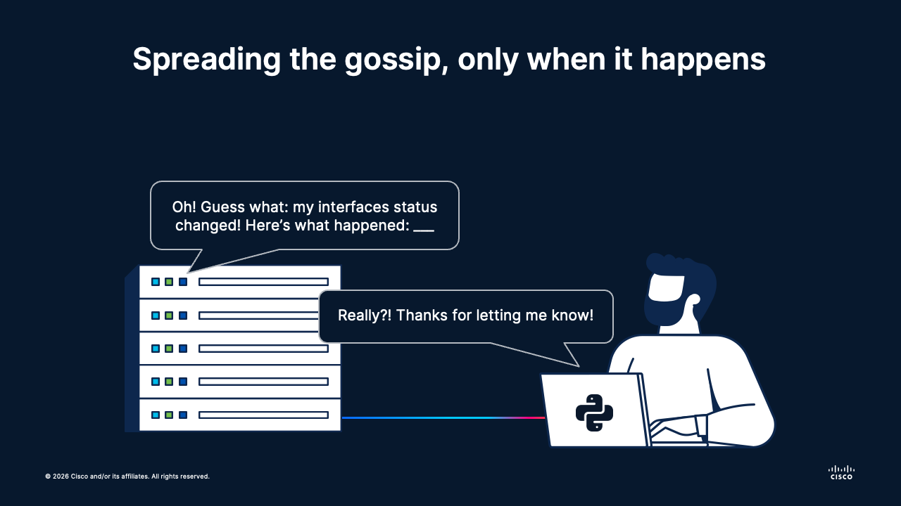

# 🛰️ Session 04 | Lesson 01: gNMI Protocol Essentials
Topics: 🔌 gRPC transport · 🌿 YANG-driven subscriptions · 📡 Push-based streaming

---

## 🎯 By the end of this lesson you will be able to:

| # | Skill |
|:---:|:---|
| 1 | 🛰️ Explain gNMI architecture: gRPC transport, YANG model subscriptions, and differences from pull-based APIs |
| 2 | 📊 Compare subscription modes: STREAM (continuous), ONCE (snapshot), and POLL (on-demand) |
| 3 | 🔐 Understand TLS security, capability exchange, and device authentication in gNMI |
| 4 | 🎯 Describe dial-in vs. dial-out connection patterns and when to use each |
| 5 | 🧭 Design efficient YANG path filters to minimize bandwidth and CPU overhead |

---

## 🗺️ What is going on

<div align="center"></div></br>

---

Imagine that we want to be actively monitoring the status of a routing protocol in our devices, so that whenever something goes wrong - like an outage, a traffic burst, or something worse, we can act accondingly and avoid a catastrophy!

When using CLI, NETCONF or RESTCONF, we poll our devices ourselves - meaning, we actively reach out and query data about configurations or statuses. Although we could be sending these queries on a fixed interval of time, ideally we want to be notified whenever something changes, right on the spot.

There is a protocol and a set of associated tools that we can use to actually do that: the **gNMI** protocol uses the binary `gRPC` over HTTP/2 and the good ol' YANG models we already know so much about to stream _only the data you care about, only when it changes._

In this lesson, we will explore the foundations of this protocol and its use in telemetry!

**🏅 Golden rule:**
> Stream only what you need: the device knows its state better than you do.

---

## 🌐 Why gNMI?

gRPC is a high-performance RPC framework that:
- Uses **HTTP/2** for transport multiplexing (multiple concurrent streams over one connection)
- Serializes messages with **Protocol Buffers** (compact binary format, 10x smaller than JSON)
- Supports **server-push** semantics natively, enabling true streaming
- Includes built-in **TLS encryption** and certificate-based authentication

> The device **only streams updates for paths explicitly listed**. This prevents wasted bandwidth.

---

## 🔄 Subscription Modes

gNMI supports three subscription modes:

| Mode | Description | Best Use |
|:---|:---|:---|
| 📡 **STREAM** | Continuous push updates at a sample interval or when values change (on-change). Example: every 5 seconds, push interface packet counters. | Near-real-time metrics for dashboards or alerting. |
| 📸 **ONCE** | Single snapshot of the requested path, then close the subscription. Example: get current interface status once, then disconnect. | One-time state checks without continuous streaming. |
| 🔄 **POLL** | On-demand polling with results returned as a stream of responses. Example: collector requests data on-demand; device responds in a subscription context. | Synchronous request-response within a streaming context. |

---

## 🔌 Dial-in vs. Dial-out

### Dial-in (Client-Initiated)

- **Collector** opens a gRPC channel to the **device** and requests subscriptions
- Flow: Collector → Device
- More common; collector controls when data flows
- Example: Y`our Python collector connects to 10 devices simultaneously`

```text
┌─────────────────────┐                        ┌──────────────────────┐
│ 💻 Collector        │───📤 gRPC Subscribe───→│ 🖥️  Device (Server)  │
│    (Client)         │                        │                      │
└─────────────────────┘                        └──────────────────────┘
                     ←───📥 Streaming Updates──────
```

### Dial-out (Device-Initiated, aka Dial-out-RPC)

- **Device** actively opens a gRPC channel to the **collector** and pushes subscriptions
- Flow: Device → Collector
- Useful in large-scale deployments with many devices and one central collector
- Example: All branch routers push telemetry to a central data center collector

```text
┌──────────────────────────┐                      ┌─────────────────┐
│ 🖥️  Device (Client)      │───📤 gRPC Channel───→│ 💻 Collector    │
│                          │                      │    (Server)     │
│                          │←─📥 Subscribe Req────│                 │
│                          │─📤 Push Updates ────→│                 │
└──────────────────────────┘                      └─────────────────┘
```

For this session, we'll focus on **dial-in** (the more common pattern for learning).

---

## 🤝 Capability Negotiation

When a collector connects to a device, they perform a capability exchange:

```text
┌─────────────────┐                          ┌──────────────────────┐
│ 💻 Collector    │                          │ 🖥️  Device           │
│                 │                          │                      │
│                 │───📤 CapabilityRequest──→│                      │
│                 │                          │ (What can you do?)   │
│                 │                          │                      │
│                 │←───📥 CapabilityResponse │                      │
│                 │   • 🔢 Protocol versions │                      │
│                 │   • 🌲 YANG models       │                      │
│                 │   • 📊 Message size      │                      │
│                 │   • 📄 Encodings         │                      │
└─────────────────┘                          └──────────────────────┘
```

**Supported encodings:**
- 📋 JSON
- 🔢 Protocol Buffers (PROTO)

This allows collectors to discover what paths and models are available before subscribing.

---

## 🗂️ Today's lab

### DevNet Always-on Sandboxes
In this case, we will use the [IOS XR Always-on](https://devnetsandbox.cisco.com/DevNet/catalog/iosxr-always-on-public_iosxr-always-on-public) device, which provides a Cisco IOSXR shared device with SSH and some other cool features that we will use later on.

> This is a **shared environment**, meaning that multiple users can access it simultaneously. You may see other users' configurations, and they can see yours. Nevertheless, this environment resets to default settings everyday.

Once you get your credentials, copy the `.env.example` file in this location and populate it with your own device's credentials:

```bash
cd session-04-telemetry/
cp .env.example .env
```

> We will use this same `.env` file for all the lessons within Session 04. This is why we are putting it in directory `session-04-telemetry/`

### Virtual Environment
Navigate to the folder `session-04-telemetry` and install today's virtual environment:

```bash
cd session-04-telemetry/
python3 -m venv .venv
source .venv/bin/activate
pip install -r requirements.txt
```

---

## 🔌 Streaming info with Python and the `gnmi` library

There is a Python library which allows us to stream data from our target devices using the gNMI protocol.

The following code snippet connects to the device via gNMI and fires a **single shot** to get information about the interfaces:

```python
# gnmi_oneshot_collector.py
import os
import json
import grpc
os.environ.setdefault("PROTOCOL_BUFFERS_PYTHON_IMPLEMENTATION", "python")

from dotenv import load_dotenv
from gnmi.proto import gnmi_pb2, gnmi_pb2_grpc

load_dotenv("../.env")

HOST     = os.getenv("GNMI_HOST")
PORT     = os.getenv("GNMI_PORT")
USERNAME = os.getenv("GNMI_USERNAME")
PASSWORD = os.getenv("GNMI_PASSWORD")

METADATA = [("username", USERNAME), ("password", PASSWORD)]

def make_path(xpath: str):
        path = gnmi_pb2.Path()
        for elem in xpath.strip("/").split("/"):
                path.elem.append(gnmi_pb2.PathElem(name=elem))
        return path

channel = grpc.insecure_channel(f"{HOST}:{PORT}")
stub    = gnmi_pb2_grpc.gNMIStub(channel)

caps = stub.Capabilities(gnmi_pb2.CapabilityRequest(), metadata=METADATA)

request = gnmi_pb2.GetRequest(
        path=[make_path("/interfaces/interface")],
        encoding=gnmi_pb2.Encoding.JSON_IETF,
)

response = stub.Get(request, metadata=METADATA)

for notif in response.notification:
        for update in notif.update:
                raw = update.val.json_ietf_val
                val = json.loads(raw) if raw else None
                print(json.dumps(val, indent=2))

channel.close()
```

### 🧩 What `gnmi_pb2` and `gnmi_pb2_grpc` actually are

When you work with gNMI at this level, think in two layers:

- `gnmi_pb2` = **data structures** (protobuf messages and enums)
    - Request/response objects: `CapabilityRequest`, `GetRequest`, `GetResponse`
    - Path objects: `Path`, `PathElem`
    - Constants/enums: `Encoding.JSON_IETF`

- `gnmi_pb2_grpc` = **RPC client interface**
    - Builds the gNMI client stub: `gNMIStub(channel)`
    - Exposes callable RPC methods on that stub: `Capabilities(...)`, `Get(...)`, `Subscribe(...)`, `Set(...)`

In short:
- Use `gnmi_pb2` to **build messages**.
- Use `gnmi_pb2_grpc` to **send those messages over gRPC**.

### 🪜 What just happened here

The following diagram describes the code snippet flow:

```text
┌────────────────────────────────────────┐      ┌────────────────────────────────────────┐
│ 💻 Your Script (gNMI client)           │      │ 🖥️ Network Device (gNMI server)        │
│                                        │      │                                        │
│ 1) 🔐 Load .env                        │      │                                        │
│    metadata = (username, password)     │      │                                        │
│                                        │      │                                        │
│ 2) 🔌 channel = grpc.insecure_channel()│      │                                        │
│ 3) 🧭 stub = gNMIStub(channel)         │      │                                        │
│                                        │      │                                        │
│ 4) 🤝 CapabilitiesRequest              │─────▶│ Receives Capabilities RPC              │
│    stub.Capabilities(...)              │      │ Checks supported models/encodings      │
│                                        │◀─────│ CapabilitiesResponse                   │
│    Print version/encodings/models      │      │                                        │
│                                        │      │                                        │
│ 5) 🌿 make_path(/interfaces/interface) │      │                                        │
│ 6) 📦 Build GetRequest(JSON_IETF)      │      │                                        │
│                                        │      │                                        │
│ 7) 📡 GetRequest                       │─────▶│ Resolves YANG path and reads data      │
│    response = stub.Get(request)        │      │ Packages data in GetResponse           │
│                                        │◀─────│ notification/update/json_ietf_val      │
│                                        │      │                                        │
│ 8) 📄 Decode json_ietf_val + print JSON│      │                                        │
│ 9) 🧹 channel.close()                  │      │                                        │
└────────────────────────────────────────┘      └────────────────────────────────────────┘
```

After running the script, you should see information about the Sandbox device's gNMI capabilities:

```bash
gNMI version: 0.10.0
Supported encodings: ['JSON_IETF', 'ASCII', 'PROTO']
Supported models: 1116 model(s)
```

And also detailed information about the current status of the interfaces:

```json
GET /interfaces/interface

{
  "name": "GigabitEthernet0/0/0/0",
  "openconfig-if-tunnel:tunnel": {
    "ipv6": {
      "router-advertisement": {
        "state": {
          "other-config": false,
          "managed": false,
          "mode": "ALL",
          "enable": true
        },
        "config": {
          "other-config": false,
          "managed": false,
          "mode": "ALL",
          "enable": true
        }
      }
    }
  },
  "subinterfaces": {
    "subinterface": [
      {
        "index": 0,
        "openconfig-if-ip:ipv6": {
          "openconfig-if-ip-ext:autoconf": {
            "state": {
              "create-global-addresses": true
            },
            "config": {
              "create-global-addresses": true
            }
          },
          "state": {
            "dup-addr-detect-transmits": 1,
            "enabled": true
          },
          "config": {
            "dup-addr-detect-transmits": 1,
            "enabled": true
          },
          "router-advertisement": {
            "state": {
              "other-config": false,
              "managed": false,
              "suppress": false,
              "enable": true
            },
            "config": {
              "other-config": false,
              "managed": false,
              "suppress": false,
              "enable": true
            }
            . . .
```

---

## 🚀 What's Next

When using a single `stub.Get(...)`, we are just getting the interface information at that exact moment in time, which is conceptually similar to a one-time query with the other tools we've used so far.

The real deal comes when we use the other streaming options described earlier!
