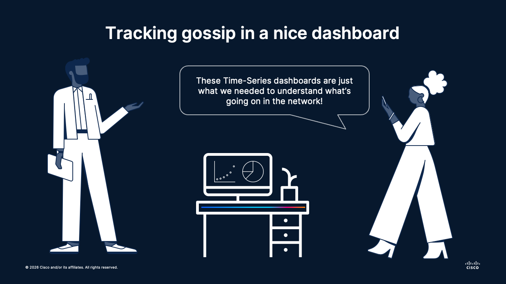
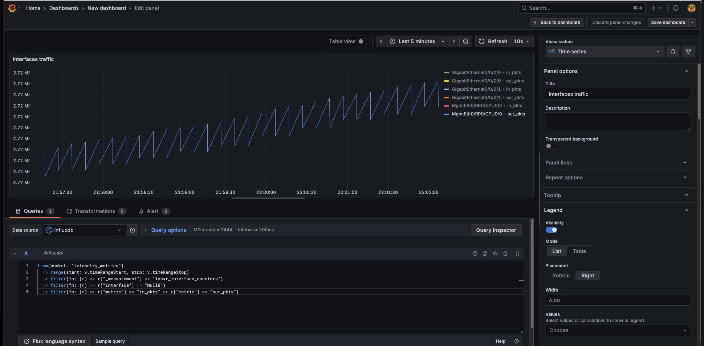

# 💾 Session 04 | Lesson 03: Telemetry Persistence and Querying
Topics: 🧪 Minimal lab · 🔌 Interface counters · 📊 Grafana table

---

## 🎯 By the end of this lesson you will be able to:

| # | Skill |
|:---:|:---|
| 1 | 🚀 Start InfluxDB + Grafana with one Docker command |
| 2 | 📝 Stream interface counters from IOS XR and write them to InfluxDB |
| 3 | 📊 Build a simple Grafana **table** with latest interface values |

---

## 🗺️ What is going on

<div align="center"></div></br>

---

What is the most common use for these telemetry techniques on the realm of Data Networks?

That would be monitoring and querying, certainly. Using a gNMI + Python collector, a time-series database and a dashboard framework, it is possible to represent the evolution in time of a certain parameter of our target devices. This is extremely useful for evaluating degradation of services, identifying peak times, and detecting other meaninful trends in our networks.

### 🧱 A telemetry stack for your network

The following diagram represents what is going to be the layout of this final project:

```text
         📡 Telemetry Source (IOS XR Device)
           |
           | gNMI STREAM (JSON IETF)
           v
  +------------------------------------------------------------+
  | 🐍 gNMI Python Collector                                   |
  | cpu_stream_to_influx.py                                   |
  | - subscribes to interface counters (in-pkts / out-pkts)   |
  | - parses updates and builds points                         |
  +------------------------------------------------------------+
           |
           | HTTP Write API (line protocol)
           v
  +------------------------------------------------------------+
  | 🗄️ InfluxDB Container                                      |
  | - bucket: telemetry_metrics                                |
  | - stores time-series telemetry                             |
  +------------------------------------------------------------+
           |
           | Flux queries
           v
  +------------------------------------------------------------+
  | 📊 Grafana Container                                       |
  | - queries InfluxDB                                         |
  | - renders table/dashboard for latest interface counters    |
  +------------------------------------------------------------+

Data Flow Summary:
IOS XR 📡 -> Python Collector 🐍 -> InfluxDB 🗄️ -> Grafana 📊
```

For building this telemetry stack, we will use a series of platforms that might be new to you. While going in-depth on each is outside of the scope of this crash course, it is important for you to be aware of the purpose of each:

| Component | What it is | Why we use it in this lesson |
|:--|:--|:--|
| 🐳 Docker | A platform to run apps in isolated containers. | Lets you start InfluxDB and Grafana quickly with `docker compose up -d` and no manual install. |
| 🗄️ InfluxDB | A time-series database optimized for timestamped metrics. | Stores interface counters over time so you can query recent and historical values. |
| 📊 Grafana | A visualization and dashboard tool. | Reads data from InfluxDB and shows it as a clear table/dashboard for monitoring. |

---

## 🗂️ Today's lab

For this lesson, we will reuse the [IOS XR Always-on](https://devnetsandbox.cisco.com/DevNet/catalog/iosxr-always-on-public_iosxr-always-on-public) device from the last lesson.

Likewise, we will reuse the same environment variables, so make sure to have a `.env` file populated with the credentials of your Sandbox device in the `session-04-telemetry/` directory.

### Virtual Environment

We will reuse as well the Virtual Environment, so go ahead and activate it for this lesson:

```bash
cd session-04-telemetry/
source .venv/bin/activate
cd 02-gnmi-collector/
```

### Docker

We will create two containers using Docker and Docker Compose. For this, I strongly recommend you to install [Docker Desktop](https://www.docker.com/products/docker-desktop/) in your host, as this is the easiest way to get Docker up and running in any system.

---

## 🚀 Step 1: Start InfluxDB + Grafana (one command)

From this folder:

```bash
cd session-04-telemetry/03-telemetry-persistence
docker compose up -d
```

The `docker-compose.yml` file in this directory is triggered. This file contains the following services:

```yaml
services:
  influxdb:
    image: influxdb:2.7
    container_name: telemetry-influxdb
    ports:
      - "8086:8086"
    environment:
      DOCKER_INFLUXDB_INIT_MODE: setup
      DOCKER_INFLUXDB_INIT_USERNAME: admin
      DOCKER_INFLUXDB_INIT_PASSWORD: C1sco123!
      DOCKER_INFLUXDB_INIT_ORG: telemetry
      DOCKER_INFLUXDB_INIT_BUCKET: telemetry_metrics
      DOCKER_INFLUXDB_INIT_ADMIN_TOKEN: telemetry-super-token
    volumes:
      - influxdb2-data:/var/lib/influxdb2

  grafana:
    image: grafana/grafana:latest
    container_name: telemetry-grafana
    ports:
      - "3000:3000"
    environment:
      GF_SECURITY_ADMIN_USER: admin
      GF_SECURITY_ADMIN_PASSWORD: C1sco123!
    volumes:
      - grafana-data:/var/lib/grafana
    depends_on:
      - influxdb

volumes:
  influxdb2-data:
  grafana-data:
```

> But wait, what is `Docker Compose`? 
Docker Compose is a tool that lets you define and start multiple containers together from one `docker-compose.yml` file, using a single command like `docker compose up -d`.

Check both containers are running:

```bash
docker compose ps
```

You should see two containers:

```bash
CONTAINER ID   IMAGE                    COMMAND                  CREATED       STATUS       PORTS                    NAMES
c49dde0f26ef   grafana/grafana:latest   "/run.sh"                9 hours ago   Up 9 hours   0.0.0.0:3000->3000/tcp   telemetry-grafana
e77fecc2e35d   influxdb:2.7             "/entrypoint.sh infl…"   9 hours ago   Up 9 hours   0.0.0.0:8086->8086/tcp   telemetry-influxdb
```

What about the components that we are spinning up here? The following table explains each container and its features:

| Container | Image | Exposed Port | Purpose in this Lab | Key Notes |
|:--|:--|:--|:--|:--|
| 🗄️ InfluxDB (`telemetry-influxdb`) | `influxdb:2.7` | `8086` | Stores telemetry metrics as time-series data. | Preconfigured with org `telemetry`, bucket `telemetry_metrics`, and token `telemetry-super-token`. |
| 📊 Grafana (`telemetry-grafana`) | `grafana/grafana:latest` | `3000` | Queries InfluxDB and visualizes latest counters in dashboards/tables. | Depends on InfluxDB and persists dashboards in `grafana-data`. |


---

## 📥 Step 2: Stream interface counters into InfluxDB

Run the minimal collector script:

```bash
cd session-04-telemetry/03-telemetry-persistence
python traffic_stream_to_influx.py
```

What this script does is the following:

1. Opens a gNMI STREAM subscription to `/interfaces/interface` on the IOS XR device.
2. Every 10 seconds, an update is received
3. Parses telemetry updates and keeps only `in-pkts` and `out-pkts` counters.
4. Writes each counter to InfluxDB (measurement: `iosxr_interface_counters`) with tags for device, interface, and metric.
5. Prints each point being written so you can verify live ingestion.

Therefore, every 10 seconds you will see something like this:

```bash
POINT: {'measurement': 'iosxr_interface_counters', 'tags': {'device': 'sandbox-iosxr-1.cisco.com', 'interface': 'MgmtEth0/RP0/CPU0/0', 'metric': 'in_pkts'}, 'fields': {'value': 3181209.0}, 'timestamp_ns': 1777841186736046596}
POINT: {'measurement': 'iosxr_interface_counters', 'tags': {'device': 'sandbox-iosxr-1.cisco.com', 'interface': 'MgmtEth0/RP0/CPU0/0', 'metric': 'out_pkts'}, 'fields': {'value': 2714097.0}, 'timestamp_ns': 1777841186736046596}
POINT: {'measurement': 'iosxr_interface_counters', 'tags': {'device': 'sandbox-iosxr-1.cisco.com', 'interface': 'GigabitEthernet0/0/0/0', 'metric': 'in_pkts'}, 'fields': {'value': 95081.0}, 'timestamp_ns': 1777841186736051796}
POINT: {'measurement': 'iosxr_interface_counters', 'tags': {'device': 'sandbox-iosxr-1.cisco.com', 'interface': 'GigabitEthernet0/0/0/0', 'metric': 'out_pkts'}, 'fields': {'value': 186909.0}, 'timestamp_ns': 1777841186736051796}
POINT: {'measurement': 'iosxr_interface_counters', 'tags': {'device': 'sandbox-iosxr-1.cisco.com', 'interface': 'GigabitEthernet0/0/0/1', 'metric': 'in_pkts'}, 'fields': {'value': 95080.0}, 'timestamp_ns': 1777841186736056254}
POINT: {'measurement': 'iosxr_interface_counters', 'tags': {'device': 'sandbox-iosxr-1.cisco.com', 'interface': 'GigabitEthernet0/0/0/1', 'metric': 'out_pkts'}, 'fields': {'value': 186891.0}, 'timestamp_ns': 1777841186736056254}
POINT: {'measurement': 'iosxr_interface_counters', 'tags': {'device': 'sandbox-iosxr-1.cisco.com', 'interface': 'MgmtEth0/RP0/CPU0/0', 'metric': 'in_pkts'}, 'fields': {'value': 3178016.0}, 'timestamp_ns': 1777841186804582920}
POINT: {'measurement': 'iosxr_interface_counters', 'tags': {'device': 'sandbox-iosxr-1.cisco.com', 'interface': 'MgmtEth0/RP0/CPU0/0', 'metric': 'out_pkts'}, 'fields': {'value': 2713901.0}, 'timestamp_ns': 1777841186804582920}
POINT: {'measurement': 'iosxr_interface_counters', 'tags': {'device': 'sandbox-iosxr-1.cisco.com', 'interface': 'GigabitEthernet0/0/0/0', 'metric': 'in_pkts'}, 'fields': {'value': 94835.0}, 'timestamp_ns': 1777841186806717508}
POINT: {'measurement': 'iosxr_interface_counters', 'tags': {'device': 'sandbox-iosxr-1.cisco.com', 'interface': 'GigabitEthernet0/0/0/0', 'metric': 'out_pkts'}, 'fields': {'value': 0.0}, 'timestamp_ns': 1777841186806717508}
POINT: {'measurement': 'iosxr_interface_counters', 'tags': {'device': 'sandbox-iosxr-1.cisco.com', 'interface': 'GigabitEthernet0/0/0/1', 'metric': 'in_pkts'}, 'fields': {'value': 94836.0}, 'timestamp_ns': 1777841186809027415}
POINT: {'measurement': 'iosxr_interface_counters', 'tags': {'device': 'sandbox-iosxr-1.cisco.com', 'interface': 'GigabitEthernet0/0/0/1', 'metric': 'out_pkts'}, 'fields': {'value': 0.0}, 'timestamp_ns': 1777841186809027415}
```

To stop it, press `Ctrl+C`.

### ⏱️ What InfluxDB stores

InfluxDB stores **time-series points**. Each point has:

- **Bucket**: the logical container/database (`telemetry_metrics`).
- **Measurement**: the metric family (`iosxr_interface_counters`).
- **Tags**: indexed labels for filtering/grouping (`device`, `interface`, `metric`).
- **Field**: the numeric value itself (`value`).
- **Timestamp**: when the sample happened (from gNMI update time).

In this lab, each update creates points like:

`bucket=telemetry_metrics, measurement=iosxr_interface_counters, tags={device=..., interface=..., metric=in_pkts}, field value=<counter>, timestamp=<event time>`

---

## 🔎 Step 3: Quick data check in InfluxDB

In InfluxDB UI (`http://localhost:8086`), login using the credentials mentioned in the `docker-compose.yml` file.

1. Go to **Data Explorer**
2. Select bucket: `telemetry_metrics`
3. Run this Flux query:

```flux
from(bucket: "telemetry_metrics")
  |> range(start: -15m)
  |> filter(fn: (r) => r._measurement == "iosxr_interface_counters")
  |> filter(fn: (r) => r._field == "value")
  |> last()
```



If rows show up, your pipeline is working.

---

## 📊 Step 4: Build a Grafana interface table

1. Open Grafana: `http://localhost:3000` using the credentials mentioned in the `docker-compose.yml` file
2. Login with `admin` / `admin`
3. Add data source:
   - Type: **InfluxDB**
   - Query language: **Flux**
   - URL: `http://influxdb:8086`
   - Organization: `telemetry`
   - Token: `telemetry-super-token`
   - Default bucket: `telemetry_metrics`
4. Save & Test

Create table panel:

1. **Dashboards** → **New** → **Add visualization**
2. Pick your InfluxDB source
3. Paste this query:

```flux
from(bucket: "telemetry_metrics")
  |> range(start: v.timeRangeStart, stop: v.timeRangeStop)
  |> filter(fn: (r) => r["_measurement"] == "iosxr_interface_counters")
  |> filter(fn: (r) => r["interface"] != "Null0")
  |> filter(fn: (r) => r["metric"] == "in_pkts" or r["metric"] == "out_pkts")
```

4. Set visualization type to **Table**
5. Save dashboard


---

## 🧹 Cleanup

When the lab is done:

```bash
cd session-04-telemetry/03-telemetry-persistence
docker compose down
```

If you also want to remove saved DB/dashboard data:

```bash
docker compose down -v
```


---

## 🚀 What's Next

Not much else in this moment! as **we've reached the end of this crash course!**

I want to deeply thank you for your time and interest during these sessions together!

I hope that you found these topics, use cases and demos interesting, and that you can apply something in your day-to-day network operations.

Do not hesitate to reach out to me [via LinkedIn](https://www.linkedin.com/in/asandovalros/) if you have any questions!


For now, happy coding! ☕️